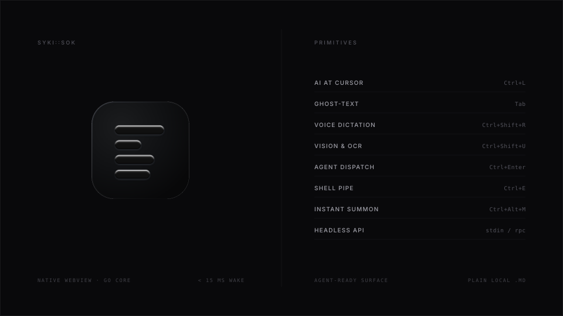
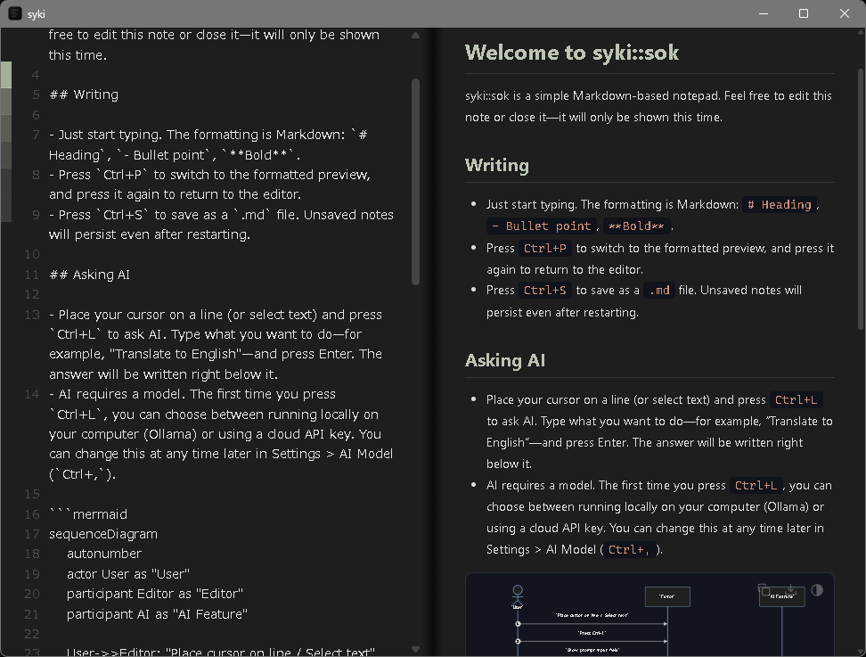

# syki::sok

An instant, featherweight Markdown scratchpad with AI right at your cursor.  
No chat bubble. No copy-paste.

<p align="center">
  
</p>

---

### Primitives

| Action | Trigger | Outcome |
| :--- | :--- | :--- |
| **AI at Cursor** | `Ctrl+L` | Generates directly below selection. No chat hopping. |
| **Ghost-Text** | `Tab` | Local LLM predicts next sentence inline as you type. |
| **Voice Dictation** | `Ctrl+Shift+R` | Real-time AI dictation & in-place rescue prompt. |
| **Vision & OCR** | `Ctrl+Shift+U` | Smart OCR paste & instant zero-app mobile drop. |
| **Agent Dispatch** | `Ctrl+Enter` | Delegates `{{ @claude ... }}` tasks autonomously. |
| **Shell Pipe** | `Ctrl+E` | Streams selected lines into `jq`, `sort`, or CLI. |
| **Instant Summon** | `Ctrl+Alt+M` | Instant &lt; 15 ms wake via Go core (5–15 MB idle). |
| **Headless API** | `stdin / rpc` | `cat log \| syki` and complete JSON-RPC for agents. |

---

### Install

```powershell
# Windows (PowerShell)
Invoke-WebRequest https://github.com/youshinh/syki-sok/releases/latest/download/syki-windows-x64.zip -OutFile syki.zip; Expand-Archive syki.zip syki; syki\syki.exe
```

```bash
# macOS (Homebrew)
brew install --cask youshinh/tap/syki
```

---

### Docs for AI

Feed **[`llms.txt`](llms.txt)** directly into your AI (Claude, ChatGPT, Gemini, Ollama) to ask anything. Complete specification, shortcuts, and APIs are self-contained in this single file.

*Human docs: [Web Manual](https://youshinh.github.io/syki-sok/manual.html) • [日本語 README](README_JA.md)*

---

<p align="center">
  
</p>

---

### License

Distributed under the [MIT License](LICENSE).
