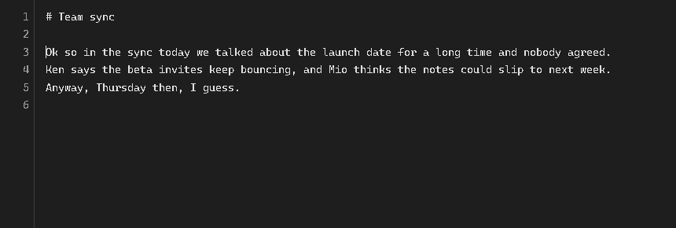
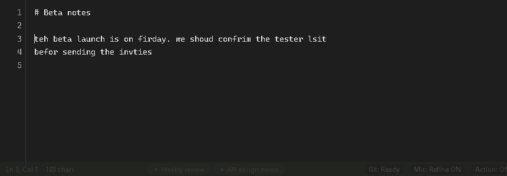
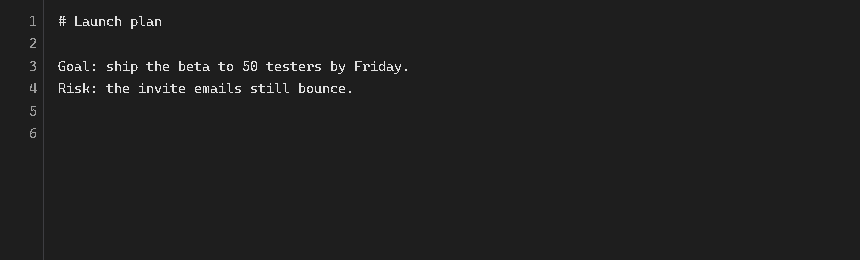
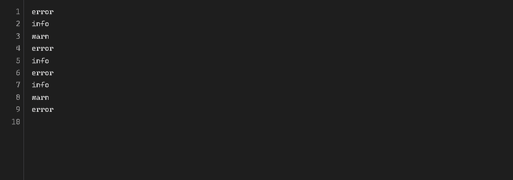
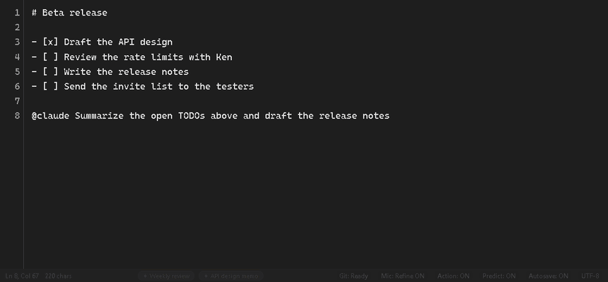
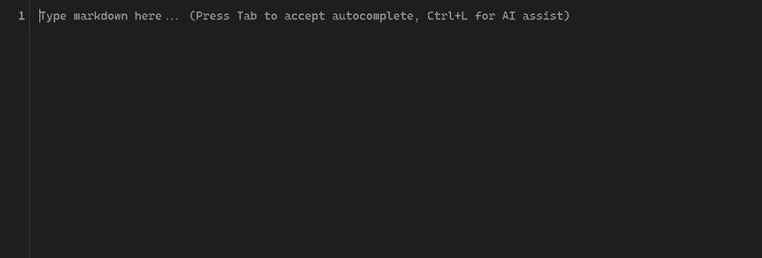

# syki::sok

**A featherweight Markdown scratchpad with AI right at your cursor.**  
It is already open when the thought arrives. No chat window, no copy and paste.

[](LICENSE)
[](#install)
[](https://github.com/youshinh/syki-sok/releases/latest)
[](https://youshinh.github.io/syki-sok/manual.html)

<p align="center"></p>

[**Download**](https://github.com/youshinh/syki-sok/releases/latest) • [Manual](https://youshinh.github.io/syki-sok/manual.html) • [日本語 README](README_JA.md) • [All features](docs/features.md)

---

## Highlights in 3 Seconds

- ⚡ **Instant & Featherweight**: `Ctrl+Alt+M` brings it forward instantly. Native WebView (Go core, zero Electron) uses just 5–15 MB idle.
- 🤖 **AI Where You Type**: Zero back-and-forth chat windows. Press `Ctrl+L` and the answer lands directly below your selection.
- 🔮 **Ghost-Text Predictions**: Local models (Ollama, LM Studio) propose the next sentence in grey text as you type; hit `Tab` to accept.
- 🛠️ **Text is the Command Line**: Press `Ctrl+E` to pipe lines into `sort` or `jq`; press `Ctrl+Enter` to delegate tasks to Claude Code or Codex.
- 📂 **Plain Local Files**: Plain `.md` files on your disk. Background Git sync and 100% offline usage supported.

---

## Essential Shortcuts

| Task | Windows | macOS | Action |
|---|---|---|---|
| **Bring Forward** | `Ctrl+Alt+M` | `Opt+Cmd+M` | Summons syki::sok instantly, restoring caret position |
| **Ask AI** | `Ctrl+L` | `Cmd+L` | Types instruction for selection; result lands below without overwriting |
| **Fix Typos / Slips** | `Alt+C` | `Cmd+Shift+C` | One-key in-place proofreading and typo correction |
| **Accept Prediction** | `Tab` | `Tab` | Accepts grey text prediction from local model |
| **Pipe to CLI** | `Ctrl+E` | `Cmd+E` | Runs selection through shell commands (`sort`, `jq`, `prettier`) |
| **Delegate to Agent** | `Ctrl+Enter` | `Cmd+Enter` | Runs `{{ @claude ... }}` background tasks autonomously |
| **Suggest Next Steps** | `Ctrl+J` | `Cmd+J` | Recommends up to 3 next actions based on context |
| **Switch Notes** | Right-click / `Ctrl+Shift+F` | Right-click / `Cmd+Shift+F` | Right-click expands Open Notes submenu, or search all daily notes |
| **Mermaid Live Preview** | `Ctrl+Alt+V` | `Cmd+Opt+V` | Converts bullet lists to flowcharts and previews Markdown live |
| **Command Palette** | `Ctrl+Shift+P` | `Cmd+Shift+P` | Search and run any command |

---

## See It in Action

<details open>
<summary><strong>Quick feature previews (click to toggle)</strong></summary>

### Ask AI at the cursor (`Ctrl+L`)
<p align="center"></p>

### Fix typos in one key (`Alt+C`)
<p align="center"></p>

### Predictions as you type, `Tab` to accept
<p align="center"></p>

### Run a command over your text (`Ctrl+E`)
<p align="center"></p>

### Hand a job to an agent (`Ctrl+Enter`)
<p align="center"></p>

### Live preview, Mermaid diagrams included (`Ctrl+Alt+V`)
<p align="center"></p>

</details>

---

## Other Built-in Capabilities

- **Smart Paste (`Ctrl+V`)**: Converts web pages, Word and Excel into clean Markdown. Screenshots are transcribed via OCR.
- **Voice Input (`Ctrl+Shift+R`)**: Dictate text with AI proofreading or apply it directly as an edit instruction to the selection.
- **Mobile Drop (`Ctrl+Shift+U`)**: Scan a QR code to drop photos, audio notes, and text from your phone directly into the note. No app needed.
- **Discord Bridge**: Message your private bot from anywhere; notes land in today's scratchpad on next launch.
- **Hot Folder**: Drop files into a folder to auto-transcribe audio or OCR images into Markdown.
- **IME Guardian**: Automatically prevents unintended full-width characters in code blocks and URLs.
- **Zen Mode (Shift+F11)**: Clears all toolbars and distraction for pure writing focus.
- **Terminal & Scripting**: `cat build.log | syki` pipes stdin straight into the active note. JSON-RPC API included.

---

## Install

**Windows** (PowerShell):
```powershell
Invoke-WebRequest https://github.com/youshinh/syki-sok/releases/latest/download/syki-windows-x64.zip -OutFile md-memo.zip
Expand-Archive md-memo.zip -DestinationPath md-memo
md-memo\syki.exe
```

**macOS** (Homebrew):
```bash
brew install --cask youshinh/tap/md-memo
```
*(On first launch on macOS, open System Settings → Privacy & Security and click Open Anyway)*

All release packages are available on [GitHub Releases](https://github.com/youshinh/syki-sok/releases/latest).

---

## Scripting & Agent Integration

```bash
cat build.log | syki                 # Pipe terminal logs directly into active note
md-memo buffer get                      # Read active note content
echo "- [ ] Next task" | syki buffer append # Append text to active note
md-memo agent install-skill             # Equip Claude Code or Codex with syki::sok agent skills
```

---

## Documentation

- [Official Manual](https://youshinh.github.io/syki-sok/manual.html) ([日本語](https://youshinh.github.io/syki-sok/manual_ja.html)): Detailed guide with screenshots
- [Features Reference](docs/features.md) ([日本語](docs/features_ja.md)): Complete specification, settings, and shortcuts

## License

Distributed under the [MIT License](LICENSE). Free for personal and commercial use.
