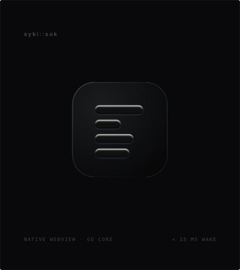
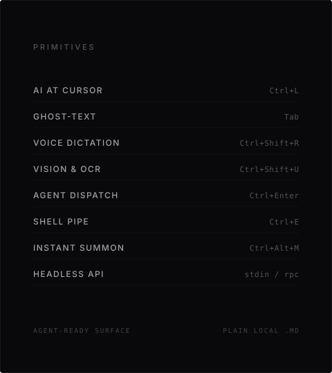

# syki::sok

カーソルの位置にAIがいる、軽量Markdownスクラッチパッド。  

<p align="center">
  
  
</p>

---

### プリミティブ（基本機能）

| 機能 | キー / 入力 | 挙動 |
| :--- | :--- | :--- |
| **カーソル直結AI** | `Ctrl+L` | 選択行の直下に直接ストリーミング生成。別窓ホッピングなし。 |
| **予測補完** | `Tab` | ローカルLLMによるインライン次文提案を1打鍵で確定。 |
| **音声入力** | `Ctrl+Shift+R` | AI推敲付きリアルタイム音声入力・レスキュー指示。 |
| **画像 ＆ OCR** | `Ctrl+Shift+U` | スマートOCRペースト ＆ アプリ不要のスマホQRドロップ。 |
| **エージェント委譲** | `Ctrl+Enter` | `{{ @claude ... }}` バックグラウンド自律タスク実行。 |
| **シェル・パイプ** | `Ctrl+E` | 選択テキストを `jq` や `sort`、CLIスクリプトに流し込む。 |
| **前面呼び出し** | `Ctrl+Alt+M` | 15ms未満で前面復帰（Goネイティブ / 待機メモリ 5–15MB）。 |
| **外部制御API** | `stdin / rpc` | `cat log \| syki` の標準入力受け取り ＆ 完全な JSON-RPC 連携。 |

---

### インストール

```powershell
# Windows (PowerShell)
Invoke-WebRequest https://github.com/youshinh/syki-sok/releases/latest/download/syki-windows-x64.zip -OutFile syki.zip; Expand-Archive syki.zip syki; syki\syki.exe
```

```bash
# macOS (Homebrew)
brew install --cask youshinh/tap/syki
```

---

### Docs for AI

詳細や設定は、**[`llms.txt`](llms.txt)** をそのままお使いの AI（Claude, ChatGPT, Gemini等）に渡して質問してください。

*人間用: [Webマニュアル](https://youshinh.github.io/syki-sok/manual_ja.html) • [English README](README.md)*

---

<p align="center">
  
</p>

---

### ライセンス

[MIT License](LICENSE)
