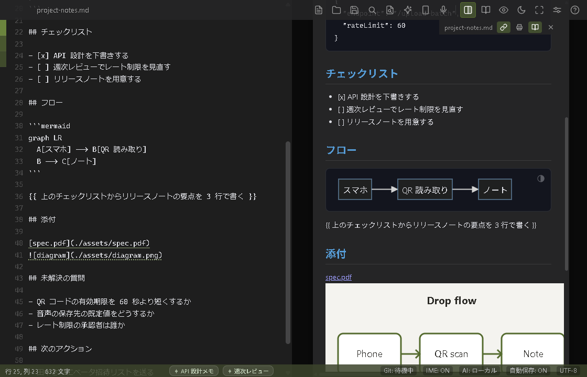
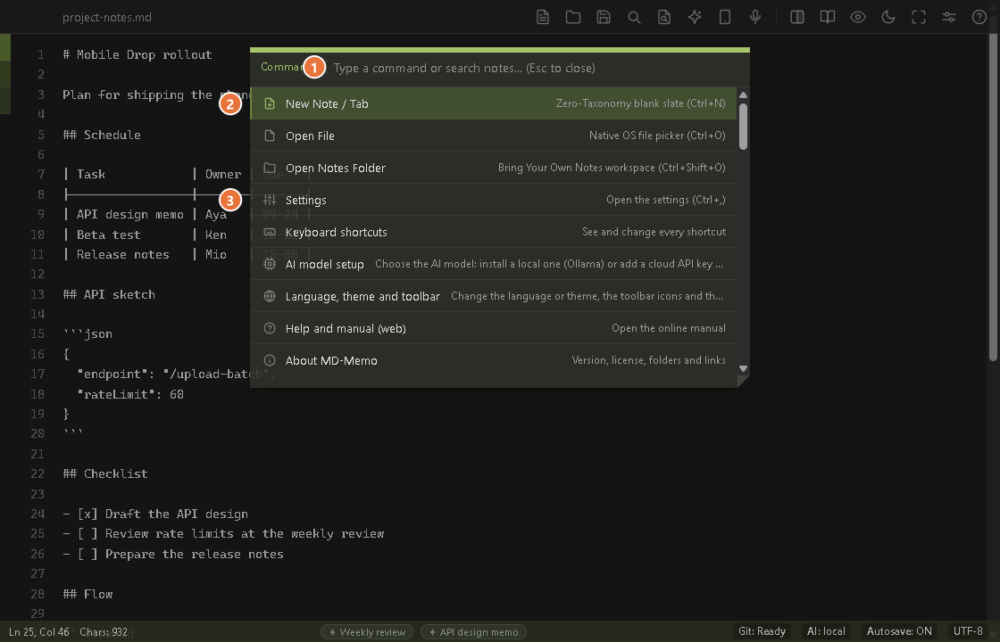
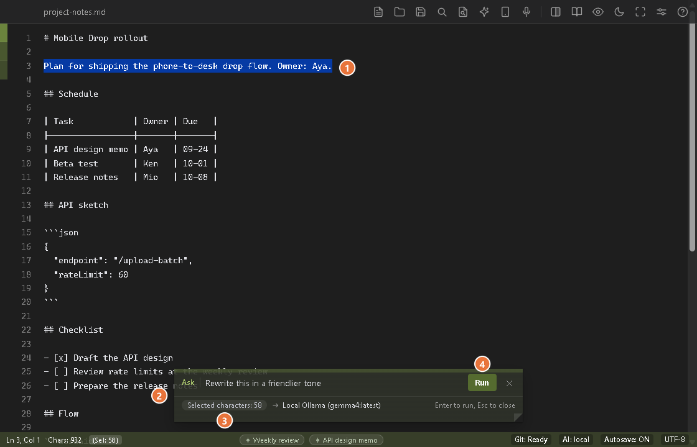
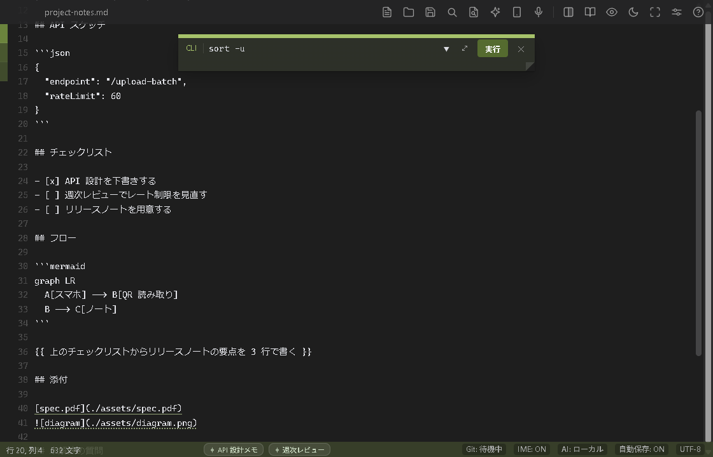
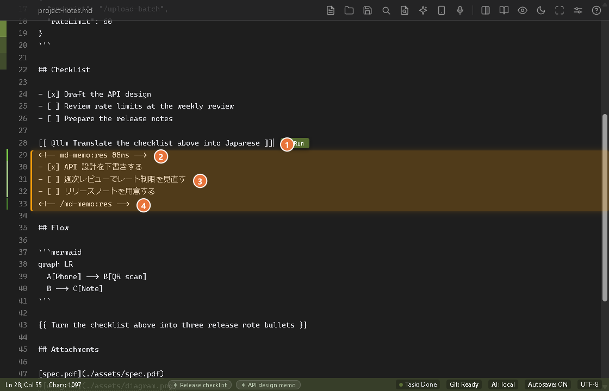
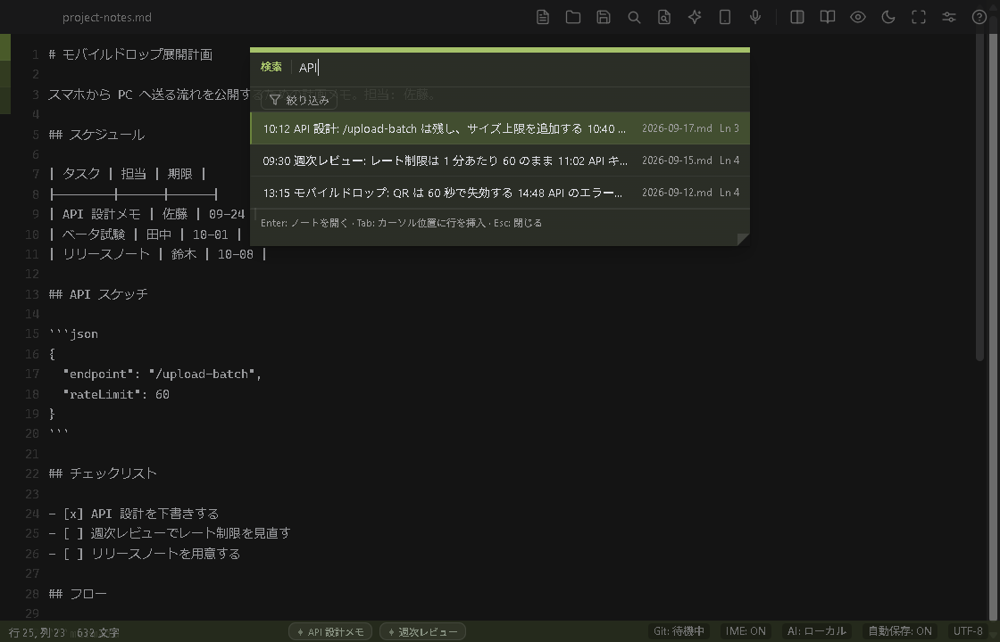
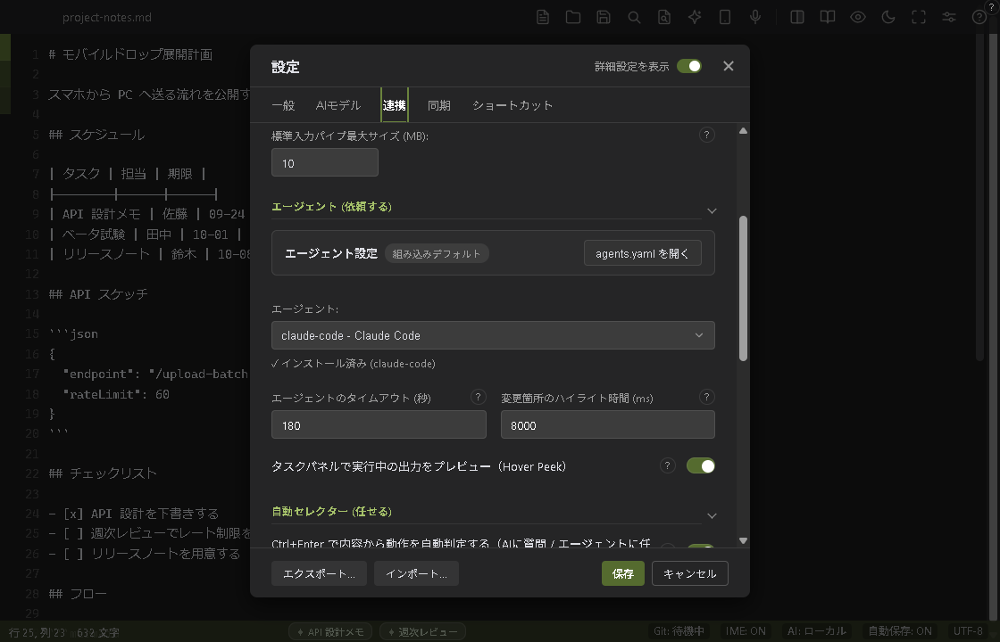
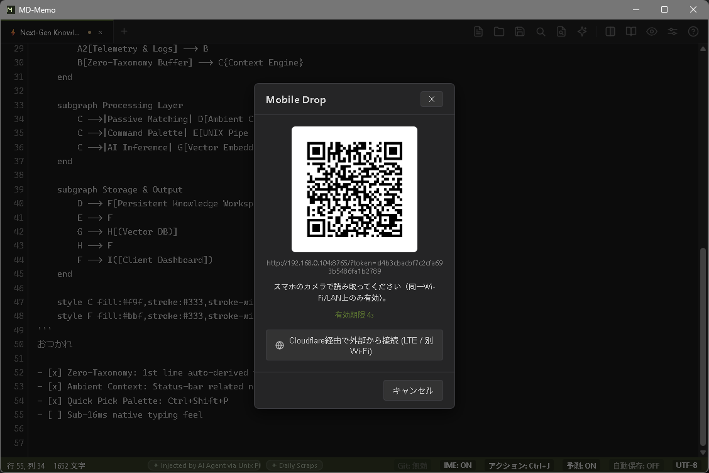

# syki::sok: Feature Reference

The complete, detailed description of every feature, shortcut and command-line option. For the short version, see the [README](../README.md).

[Official Manual](https://youshinh.github.io/syki-sok/manual.html) • [日本語マニュアル](https://youshinh.github.io/syki-sok/manual_ja.html) • [Releases](https://github.com/youshinh/syki-sok/releases) • [日本語版 (features_ja.md)](features_ja.md)

---

## Visual Showcase

| Live Split View & Mermaid Diagrams (`Ctrl+\`) | Command & Navigation Palette (`Ctrl+Shift+P`) |
|:---:|:---:|
|  |  |

| Ask AI (`Ctrl+L`) | Command Bar (`Ctrl+E`) |
|:---:|:---:|
|  |  |

| Auto Selector (`Ctrl+Enter`) |
|:---:|
|  |

| Parallel Daily Scrap Search (`Ctrl+Shift+F`) | Autonomous Agent & Orchestration Settings |
|:---:|:---:|
|  |  |

---

## The Scratchpad Paradox

Modern knowledge bases (like Obsidian or Notion) are phenomenal for structuring long-term data, but their architectures inherently introduce startup latency and heavy memory footprints. When you need to capture a fleeting thought or pipe an ephemeral error log, a 2-second Electron initialization breaks cognitive momentum.

**syki::sok is not a replacement for your vault; it is the zero-friction buffer in front of it.**

| Dimension | Standard Text Editor | Knowledge Vaults | syki::sok |
|---|---|---|---|
| **Architecture** | C++ / Swift | Electron / JVM | **Go 1.26 + OS-Native WebView** |
| **Summon Latency** | ~100ms (Cold) | 2.0s – 5.0s | **< 15ms (from System Tray)** |
| **Idle Memory** | ~15 MB | 400 MB – 800 MB+ | **5 – 15 MB (Aggressive GC)** |
| **Storage Model** | Plain text | Internal DB / Proprietary | **100% Local POSIX Plain Text** |
| **Programmable IPC** | Socket plugin / none | Heavy HTTP plugins | **Zero-latency JSON-RPC 2.0 TCP** |
| **File Dialogs** | OS Native | Node.js IPC wrapper | **Windows: native COM `IFileDialog`. macOS: system file chooser via AppleScript.** |

> **Workflow Tip**: Point syki::sok directly at your Obsidian Vault, Git repository, or daily log directory to use it as an instant-entry terminal.

---

## Which One Do I Use?

Everything AI-related is organized around three verbs — Write, Run, and Delegate — and each has a single entry point to remember: Ask AI is `Ctrl+L`, the Command Bar is `Ctrl+E`, and Delegate is `Ctrl+Enter`. `Ctrl+Enter` is also the do-what-I-mean key: it reads the line you are on and picks the action, and `Ctrl+J` suggests a next step when you are not sure.

| What you want | Entry point | What it does |
|---|---|---|
| **Write** — fix or draft the text in front of you | Ask AI `Ctrl+L` / `Cmd+L` | The built-in LLM works on your selection (or the current line) and inserts its answer right below it, in seconds |
| **Run** — execute a command | Command Bar `Ctrl+E` / `Cmd+E` (type the command yourself; press `Tab` for AI mode, where you describe it in plain language and the AI writes it) | Pipes your selection through a shell command and adds the output below it (a setting can replace the selection instead) |
| **Delegate** — hand off a whole investigation or implementation, or let one key work out what a line asks | Auto selector: `Ctrl+Enter` / `Cmd+Enter` on a line (or write `{{ @agent instruction }}` yourself) | Decides from the line whether to ask the built-in LLM, hand it to an external agent CLI (which works in the background for minutes) or run a command, and writes the result below the line |
| **Not sure what to do** | `Ctrl+J` / `Cmd+J` | Suggests up to three next steps for what you are writing (Quick Actions) |

*(See the [Official Manual](https://youshinh.github.io/syki-sok/manual.html) for the full walkthrough of each)*

---

## Architecture & Capabilities

### 1. Minimal Footprint & Sub-Millisecond Wake
Built to run 24/7 without taxing your system.
- **Instant Summon (`Ctrl+Alt+M` / `Option+Cmd+M`)**: Bypasses heavy rendering pipelines to wake instantly with your cursor exactly where you left it. On Windows this wakes it from the system tray; on macOS, where there is no menu-bar icon, it brings the app forward from the Dock (clicking the Dock icon does the same — quit with `Cmd+Q`).
- **Aggressive Idle Reclamation**: Leverages `debug.FreeOSMemory()` to compress the active working set down to 5–15 MB when the window is minimized or idle.
- **Tabs take no room**: the open notes are a thin strip of colour on the left edge of the window (6 px; the note you are on is the strongest, the others fade with their distance from it). Rest the pointer on it, or press `F6`, and it widens over the text to show the names, the unsaved dots and `+`; the text underneath is not laid out again, so it costs the note nothing. With two note pages each page has its strip; with many notes the strip squeezes and scrolls, and an *All tabs* button opens a list beside it.
- **Two pages, one divider**: `Ctrl+\` puts two notes side by side and `Ctrl+Alt+V` puts a preview beside the note. Between two note pages the divider is a gutter, a soft shadow with dots that fade towards both sides; beside a preview it is only the step between the page and the desk. Drag it, or press `F6` until the focus is on it (the editors keep `Tab` for indenting) and use `←` / `→` (2 points at a time, `Shift` for 10), `Home` / `End` (the left page at its narrowest, 15%, or its widest, 85%) and `Enter` (back to half and half; a double-click does it too); `Esc` returns to the note. At half and half the two pages are exactly as wide as each other. The widths are not remembered: the next start is half and half again. Settings → General → Appearance & Window → *Divider between two pages* picks the look: gutter (the default), shadow only or a thin line.
- **Native OS Dialogs**: Windows uses native COM `IFileDialog` panels; macOS uses the system file chooser via AppleScript. Both keep file operations instantaneous without an Electron-style wrapper.

### 2. Autonomous IME Shield (IME Guardian)
Technical writing in multilingual CJK environments often suffers from IME mode-switching friction. syki::sok handles this algorithmically:
- **Lexical Scope Protection**: Inside inline code (`` `...` ``), code blocks, and URLs, the editor intercepts full-width characters and forces alphanumeric mode with negligible overhead (~11 µs per keystroke).
- **Phonological Auto-Correction**: Detects Romaji cadence typed in direct input mode and can silently convert it into composition.
- **Powered by LLRT**: Computational linguistics via Log-Likelihood Ratio Testing ensures your typing speed is never compromised.
- **Platform note**: On Windows the Guardian switches the OS input source for you, and it starts on when your system language is Japanese. macOS can't switch the input source automatically yet, so it starts off there.

### 3. Write, Delegate, Suggest — Local-First AI
AI should act as an unobtrusive shadow, not a distracting chat window.
- **Write: Ask AI (`Ctrl+L`)**: Give an instruction about the selection, the current line, or the whole note (when the caret is on a blank line), and the built-in LLM inserts its answer right below it in seconds; your own text is never replaced. `Alt+C` proofreads without needing an instruction at all, and the command palette ships presets for polishing, bullet summaries, and action-item extraction.
- **Ghost Text (the passive form of Write)**: Offline predictive completion powered by your local Ollama, LM Studio, or vLLM instance.
- **Delegate (`{{ instruction }}`, `{{ @agent instruction }}`)**: Hand an instruction written in the note to an external agent CLI (Claude Code, Codex, Hermes, Antigravity, …). Press `Ctrl+Enter` with the caret in the block, or click the **Run** button that appears beside a complete block. It runs in the background and progress shows in the task panel (`Alt+T`). A classic `{{ }}` slot is replaced by the result, as before; a `{{ @agent ... }}` task, named by an `agents.yaml` key or an alias such as `claude` or `cc`, keeps its line and gets the result below it. Notations, agents and aliases are fully customizable in `agents.yaml` (internal name: Slot). An agent whose definition skips its own permission prompts (such as `--dangerously-skip-permissions`) is confirmed with you once before it runs, and Settings → Agent points out agent definitions worth a look; your `agents.yaml` is never rewritten. Agents you never use can be switched off there (`enabled: false` or `disabled_agents`): a disabled agent is not listed, never chosen, and naming it in a note says so instead of running anything. If an agent's program is not found in PATH, the run says so before it starts and leaves the note as it was. With the Auto selector switched off, or on a blank line, `Ctrl+Enter` keeps the classic rule: the slot under the caret, else the next slot after it, else the first slot in the note.
- **Lessons (the Lessons button on a finished task in the task panel, `Alt+T`)**: When a delegated agent task fails, or comes back with something you did not want, press **Lessons** on its card in the task panel to keep a short rule from that run. The dialog first says what would be sent (how many characters of the instruction, of the end of the agent's output and of the error message, how many secrets are blanked out) and where (a model on this PC, or a cloud host you must allow first), and has a box for what went wrong. **Create a proposal** then asks the text model of Settings → AI Models for one or two one-sentence rules; you edit them, untick any you do not want, and press **Save**. Rules go into `lessons/<agent>.md` in the settings folder, a plain Markdown file with one `- rule <!-- date -->` line each that you can open (command palette: **Open the lessons file**), edit or delete. From then on, each time that agent runs a delegated task (`{{ @agent ... }}`, or the default agent of a plain `{{ }}`), the newest rules (at most 30 and 4,000 characters) are put in front of your instruction and the task card says "N lessons applied". `lessons: false` under an agent in `agents.yaml` switches it off for that agent. Nothing is automatic: no rule is written and nothing is sent to a model until you press the buttons. It keeps the same mistake from repeating; it does not promise a better result, and a small local model can write vague rules, so read them before you save. The idea comes from the GEPA paper on reflective prompt evolution (arXiv 2507.19457); syki::sok takes only its one step (the model reflects, you approve, the rule is kept) and none of the automatic optimization. Recipes, `[[ ]]` tasks and Ask AI get no lessons.
- **Lessons: what is sent, and from a script**: Only a cut-down record of that one run goes to the model, and only after **Create a proposal**: the start of the instruction (up to 1,500 characters), the end of the output (4,000), the error message (800) and your note (500), with keys, tokens and passwords blanked out; the rest of your notes does not. A model that is not on this PC needs your permission once per host (the same list as the Ask AI bar and Deep search), checked again before sending. A rule that holds a secret, a comment mark (`<!--` or `-->`), more than 300 characters or a phrase that tries to rewrite the agent's instructions is refused. `syki lessons list [--agent <key>]` and the JSON-RPC method `lessons.list` list the files (rules, how many the next run gets, whether `lessons: false`); they only read. There is deliberately no command or method that writes a rule: it would let an agent rewrite its own future instructions with nobody approving it.
- **Auto selector (`Ctrl+Enter`)**: Press it on a line and fixed local rules (no network) decide what the line asks: an instruction for the built-in LLM, a job for an agent, or a command. Your instruction line stays and the result is written below it, between two comment lines. Because the rules can be wrong, an agent or command request is rewritten first and runs on a second `Ctrl+Enter` (`Ctrl+Z` undoes the rewrite; the confirmation can be turned off), and when the rules are unsure, such as on an ordinary sentence, the Ask AI bar opens and your note is not changed by itself. You can also write `[[ @llm instruction ]]`, `[[ $ command ]]` (checked by the Command Bar's safety guard) or `{{ @agent instruction }}` yourself and insert snippets (type `{{`, use the command palette, or type a short word such as `;sum` and press `Tab`); the automatic decision can be turned off in Settings → Agent.
- **Result blocks**: A result written below a line sits between two comment lines and shows as a green bar in the line-number gutter (bright on the opening line, light on the answer, dark on the closing line; only the gutter is painted, never the text). The command palette goes to the next or previous result block, copies one without its comment lines, deletes one, or confirms one (keeps its text and drops the comment lines, so a task notation inside it is live again). Delete and Confirm are one undo step, and each command can be given a key in Settings → Shortcuts.
- **Comment out (`Ctrl+/`)**: Hide the selected lines in `<!-- -->` and bring them back with the same key (one comment per line by default, or one around the lines in Settings → General). Commented text is hidden in the preview, and a task, slot or approval gate inside a comment never runs: with the caret inside one, `Ctrl+Enter` does nothing. Tag lines (`<!-- tags: ... -->`) are left as they are.
- **Quick Actions (`Ctrl+J`)**: Suggests up to three next steps based on what you are writing, each mapping to Write, Run, or Delegate. Run a card with `Ctrl+1`–`3` (`Cmd+1`–`3` on macOS), or move with `Ctrl+Tab` and confirm with `Enter`. Click **AI** in the status bar: the **Suggestions** switch turns it on or off, and **Only when I press Ctrl+J** makes it manual. By default it runs on built-in local rules and nothing from your note leaves your machine; only if you enter an API key or a custom endpoint does it send an excerpt of about 2,000 characters around your caret to an external inference model such as Jev (internal names: System 1 / 3-Beam / MAP-Elites).
- **Deterministic AST Guardrail**: Shell commands offered as suggestions are parsed by an AST safety checker before they run, refusing destructive operations such as `rm -rf /` and writes into protected system directories.
- **Transparent Stream Cleaning**: Automatically strips reasoning tokens (e.g., `<think>` tags from DeepSeek models) before they hit the canvas.

### 4. UNIX Pipeline & CLI Automation
Treat your notes as standard output streams.
- **CLI Standard Input (`cat log | syki`)**: Pipe terminal output directly into a running syki::sok instance via local TCP IPC. Transmits instantly or cold-boots the app if closed.
- **Command Bar (`Ctrl+E`; `Tab` switches CLI / AI mode)**: One bar with two modes, and `Ctrl+E` reopens it in the mode you used last. In CLI mode, feed the selection (or the whole note when nothing is selected) through external utilities (`jq`, `sort`, `tr`, `prettier`, `duckdb`); the output goes right below the selection, which stays (Settings → Agent → Commands can make it replace the selection instead), and, by default, also opens in a result tab; with nothing selected only the result tab opens. In AI mode, describe OS tasks naturally (*"find files modified today"*) and it writes the shell command into the field; the bar then returns to CLI mode so you can check it (a safety check flags risky commands) and press Enter to run it in a background goroutine. Clicking the badge on the bar switches modes too.

### 5. High-Speed Parallel Scrap Search
- **Zero-Allocation Multithreaded Scan**: Uses `runtime.NumCPU()` worker threads and `bufio.Scanner` to execute parallel, in-memory grep matching across your daily scraps (`scraps/YYYY-MM-DD.md`) in <150ms.
- **Debounced Incremental Search**: 150ms debounce ensures fluid typing, while click-to-jump instantly scrolls to the matched line with an ambient UI highlight.
- **Seeded and Quotable**: `Ctrl+Shift+F` opens with your selection (or, with none, the word before the caret) already searched, and `Tab` (or `Shift+Enter`) on a result inserts that line at the caret instead of opening its file (`Ctrl+Z` undoes it). `Ctrl+F` also starts from the selected text.
- **Filter by period and tags** (the **Filter** button under the search box): narrows the Exact search, the Meaning search and Deep search alike. **Period**: All, Today, Last 7 days, Last 30 days or This month, one at a time. It uses the date at the start of the file name (`2026-09-27.md` and `2026-09-27_title.md` both count), so a note whose name has no date is never inside a period; while a period is chosen the panel says how many such notes there are. **Tags**: the tags written in your notes, most notes first (the first 40 are shown); choose several and a note must have **all** of them (up to 8 at a time). **Clear** takes every choice off, and the button shows how many are on, such as "Filter (2)". The filter narrows a search, so there has to be a word or a question in the box. Deep search sends only what the filtered list shows. The choice lasts while the app is open and is not saved. A search with no filter works exactly as before, and the tags are read from your notes only when the Filter area is first opened.
- **Writing a tag**: one whole line that is an HTML comment, `<!-- tags: work, shopping -->` (the key may also be `tag`; separate tags with commas, spaces or semicolons; a leading `#` and capitals do not matter). The preview and the print never show it, and a search leaves it out of the lines it shows around a hit. A tag line above the note's first heading or `---` rule tags the whole note (so does a YAML front matter `tags:`, which syki::sok only reads and never writes); anywhere else it tags the entry it is in, the part between two headings (`#` to `###`) or `---` rules, which is the unit the search cuts, **and every entry under that heading**: the smaller headings that follow it, up to the next heading of the same or a higher level or the next `---` rule (a level may be skipped, `#` then `###`; `####` and deeper are text of the entry above, not boundaries). So a Web article pasted under a heading and cut into several entries by its own `##` and `###` headings is tagged by one line, and a search with that tag finds every section of it; a tag never reaches a sibling heading, a higher heading or anything below a `---` rule, so to tag one section only, put the line under that section's own heading. A hit has a tag when its own entry, a heading above it or the whole note has it, and the tag list counts the entries a tag reaches, those under a heading included. A tag line inside a code block, in the middle of a line or over several lines is not read. You can type the line yourself, or let the command palette write it (next item).
- **Adding and removing tags** (`Ctrl+Shift+P`, then type "tag"; or right-click in the editor, under Voice input): **Add a tag to this entry**, **Add a tag to the whole note** and **Remove a tag**. They act on the note in the active editor (the focused pane when split); the entry is the one that holds the caret line (a right click puts the caret where you click); with a selection over several lines it is the lowest heading that both the first and the last selected line are under, so selecting a whole pasted article tags the article as a whole. There is no new shortcut. A small picker opens with an input and a list: for adding, the list shows the tags your notes folder already uses (most notes first, with the number of notes) and, as you type, what you typed as "New tag: x"; several tags can be typed at once, separated by commas, semicolons or spaces, and a leading `#` is dropped. A single word you selected first (on one line, 200 characters or fewer; a leading `#`, quotes, brackets and the punctuation around it are trimmed) is already filled into the box, all of it selected: `Enter` adds it, typing replaces it, `Backspace` empties it (adding only; two words or several lines are not filled in). `Enter` (or `Tab`, or a click) applies the highlighted row and `Esc` closes the picker and returns to the editor. When the entry has headings above it, an **Attach to** row (**Take off from** when removing) lists its own heading and each heading above it, each with its lines, such as "Processing (10-13)"; click one, or press `Ctrl+Up` (the heading above) or `Ctrl+Down` (back), and the tag goes directly under the chosen heading and reaches everything below it (the line above the list says so, for example "Entry and everything under it (3 entries), lines 3-15", and the status line adds "It also applies to the N entries under it."). The row is not shown when there is nothing to choose between; on a Mac `Ctrl+Up` is a Mission Control shortcut, so click there. **Remove a tag** lists the tags written at the chosen heading, the tags that come from a heading above (marked `From "Heading" (line N)`; choosing one takes it off at that heading) and the tags of the whole note. syki::sok writes one line, `<!-- tags: a, b -->`, directly under the entry's heading (or on the very first line of the note for the whole note), or adds to the tag line that is already there; removing the last tag of a line deletes the line. A tag the entry already has (also through a whole-note tag or a heading above) is not written twice, and nothing else in the note changes (line endings and a byte order mark included). One `Ctrl+Z` undoes the whole change and Redo applies it again; the changed line shows in the amber band. A note that starts with a YAML front matter cannot get a whole-note tag (tag an entry, or write `tags:` in the front matter yourself), a tag that exists only in the front matter cannot be removed by the command, a tag on the other range is reported and left alone, so is a tag that a section only gets from a heading above (the status line names that heading and its line; take it off there), and a command takes at most 8 tags of 64 characters each. `Ctrl+/` leaves tag lines alone. Not available: AI suggestions of tags, tagging many notes at once, writing into a front matter, moving a tag to another heading (remove it and add it again).
- **From a script or an agent**: `syki scrap search deploy --tag work,urgent` (repeatable, at most 8, with the plain, `--ranked` and `--semantic` searches), `syki scrap tags [--json|--text]` (the tags in use with how many notes and entries carry each, how many `.md` files were read and how many have no date in the name), and in JSON-RPC the `tag` parameter of `scrap.search` (`"a,b"` or a list) and the method `scrap.tags`. A tag nobody uses gives no matches, not an error; more than 8 is an error. To change tags: `syki scrap tag add|remove <tags> [<file>] [--line N] [--write] [--json]` and `syki scrap tag show [<file>] [--line N] [--json|--text]` (without a file the text comes from standard input; without `--line` the range is the whole note, with `--line N` the entry that holds line N and every entry under its heading; N may be any line of the section, and to tag a whole pasted article give a line of its top heading). `show` also prints "tags it gets from the headings above", and removing a tag that an entry only gets from a heading above is refused with the heading and its line (exit code 1). It prints the new text and writes nothing, so `> out.md` and pipes work like `sed`; `--write` rewrites the file in place instead (a temporary file and a rename, refused if the file changed meanwhile, never creating a file), so use it on a note that is not open in the app. In JSON-RPC, `scrap.tag_edit` works the edit out from the text you send and touches no file and no screen (`return_text` asks for the whole new text; `range_start`/`range_end` cover the entry and everything under its heading, and the answer also has `descendants`, `inherited_tags`, `path` (the entry and the headings above it, nearest first: the places a tag can be attached to), and, with the new `message_code` `on_parent`, `parent_heading` and `parent_line`; every line number is a line of the old text): `buffer.get`, then `scrap.tag_edit`, then `buffer.set` with the `expected_hash` from the first call. There is deliberately no command that suggests tags with AI yet. The date range of the plain word search (`--from`/`--to`) now also counts a note named `YYYY-MM-DD_title.md`, as the Meaning search always did.

### 6. Background Git Sync
Keep your plain-text data durable and synchronized across machines.
- **Silent Operations**: Automatically runs `git pull --rebase` on launch and debounces `git add/commit/push` after 30 seconds of idle time.
- **Zero-Conflict Setup**: Simply provide an empty GitHub/GitLab repository URL in the settings to establish a bulletproof, automated cloud backup.
- **Settings packages**: Export settings, agent definitions and this project's skills into one `.mdmemopack` file (Settings → Export...) and import it on another PC (Settings → Import...). API keys are left out unless you tick **Include API keys**; agent definitions and skills that would be overwritten are backed up first. An imported package never changes where your text goes or what runs unasked on its own: a new model server address, the agent confirmation being turned off, the Discord bridge and the hot folder are listed after **Import** and applied only if you tick them.

### 7. Mobile Drop — Send From Your Phone (`Ctrl+Shift+U`)
Scan a QR code and push photos, files, a voice note, and text from your phone straight into the active note. No app, no account.

<p align="center"></p>

- **Send tray**: add up to 10 photos/files (60 MB total; per item: image ≤ 20 MB, audio ≤ 25 MB, text file ≤ 2 MB), record a voice note, and type text, then send it all with one **"Send all"** button. Photos are OCR'd, voice notes transcribed, text files appended. Composing on the phone keeps the session alive, so filling a batch never hits the idle timeout below. Each item lands under its own heading, `## Mobile Drop [14:20:05] — <filename>`, and one item that cannot be processed never stops the rest of the batch.
- **Two-way text sharing**: the text selected on the PC (or the clipboard text if nothing is selected) is shown at the top of the phone page with a one-tap copy button (refreshed every 2 seconds, up to 64 KB), and the PC dialog shows what is being shared, truncated to 80 characters.
- **Local by default**: a one-shot server on your LAN (random one-time token, checked before the request body is read; it closes after one submission or 60 seconds without activity). Nothing leaves your network.
- **Photos become text**: pictures are transcribed by the vision model you configured for `Ctrl+V` image OCR (a local Ollama or LM Studio model needs no key). With a cloud model the photo goes to that provider, exactly as with paste.
- **Never lost**: if OCR or transcription is not configured, or fails for any reason (missing API key, unsupported model, empty transcript, network error, timeout), the photo or voice note is saved like a pasted image, into `./assets/` next to the note, and linked (`` for photos, `[name](./assets/...)` for voice notes) with a one-line reason under the link. The reason is written in Japanese in both UI languages, and a toast tells how many items were saved this way. Only if saving the file fails too does an inline `[Mobile Drop: <filename> の処理に失敗しました: <error>]` line appear.
- **Robust on the phone**: right before it hands over to the camera, file picker or recorder app, the page asks the PC to keep the session open for up to 120 seconds longer, so the 60-second idle limit does not end the session while the recorder app is in front. If a send fails it is retried once when the PC session is still alive; otherwise the page says the connection to the PC is gone and asks you to reopen Mobile Drop on the PC and scan the QR code again.
- **Optional location (tunnel only)**: connected through the Cloudflare tunnel (HTTPS), the phone may attach its location once as a single silent attempt, shown only on the first item's heading as `## Mobile Drop [14:20:05] — <filename> (34.693, 135.502)`. Never requested or attached over plain LAN HTTP.
- **Optional outside access**: a button in the dialog switches to a [Cloudflare Quick Tunnel](https://developers.cloudflare.com/cloudflare-one/connections/connect-networks/do-more-with-tunnels/trycloudflare/) for mobile data or another Wi-Fi. It also enables in-page voice recording over the tunnel (plain LAN opens the phone's own recorder instead). It needs `cloudflared` installed, and the transfer then passes through Cloudflare's servers.

### 8. Smart Paste (`Ctrl+V` / `Ctrl+Shift+V`)
Two paste shortcuts, tuned for what is actually on the clipboard.
- **`Ctrl+V` pastes as Markdown**: `text/html` with structure (from a web page, Word, Google Docs or Excel) is converted to Markdown with a built-in converter — headings, lists, tables with alignment, task checkboxes, code blocks, and more — stripping `script`/`style`/`iframe`/`svg` content and `javascript:`/`data:` links for safety. HTML without structure (code and logs copied from an editor or a terminal, a single spreadsheet cell) is pasted as it is. When the clipboard holds an image and nothing else, vision OCR turns it into Markdown/Mermaid; if OCR is switched off or has no API setup, the image is saved to `./assets/` and linked instead (like `Ctrl+Shift+V` and Mobile Drop), and the message says why.
- **`Ctrl+Shift+V` pastes as it is**: plain text with no conversion; an image-only clipboard is saved to `./assets/` (extension follows the image type) and linked in, without OCR. Text alongside an image (as Excel and Word both put there) pastes the text and ignores the image.
- **Settings → General**: "Ctrl+V turns web, Word and Excel content into Markdown" (on by default). Switch it off to get the old split back: `Ctrl+V` plain, `Ctrl+Shift+V` converts.

### 9. Voice Input (`Ctrl+Shift+R`)
Press to record; a marker at the caret shows recording, then transcribing, status. The default model is Google's `gemini-3.5-transcribe`, called through the Interactions API with `store: false`, so Google does not keep your recording or transcript. Older models such as `gemini-2.5-flash` still work through the generateContent path.
- **Start it your way**: the shortcut (`Ctrl+Shift+R` / `Cmd+Shift+R` by default, and configurable in Settings → Shortcuts), the microphone button in the toolbar, the right-click menu, or the command palette. While recording, a small indicator at the bottom left shows the elapsed time; its **Stop** button ends the recording and starts the transcription (the same as pressing the shortcut again), and `Esc` discards it.
- **Settings (Settings → AI Models → Voice input)**: model, API style (Auto / Interactions API / generateContent), language codes (e.g. `ja-JP, en-US`; empty = auto-detect, mixed languages included), mode (Smart removes fillers and tidies the text; Verbatim keeps every word), custom vocabulary, and the silence timeout. The API key and base URL come from the Image OCR settings.
- **Tidying and rewriting by voice**: after the transcription, a second model (`gemini-flash-lite-latest`) removes fillers and self-corrections and fits the line you are on (list, task, table). With text selected, what you say is applied to the selection as an edit instruction. It is on by default: `Ctrl+Shift+Alt+R` records once without it, and `Ctrl+Alt+R` (or the **Voice tidy-up** switch behind **AI** in the status bar) turns it on and off. If it fails or is slow, the transcript is inserted as spoken.
- **Rescue**: if transcription fails, the audio is kept for a one-click retry, save, or discard — even after restarting the app.

### 10. File Links & Drag & Drop
Drop any file onto the editor text to insert a Markdown link at the caret (`` for images, `[name](...)` otherwise), copying it into `./assets/` (up to 25 MB) since the browser cannot see the original path. `Ctrl+Click` opens a link with the OS default app (a web address opens in the browser); `Alt+Click` reveals a file in Explorer/Finder. Every link in the editor is underlined (Markdown links, images and bare `http://` / `https://` addresses; dotted for an image, which also previews on hover), so you can tell what is clickable; `mailto:` and other schemes are not underlined and cannot be opened from the editor. The underline is skipped for very large notes (over 100,000 characters), where Ctrl+Click still works. Line numbers sit on the first screen row of each line, so a wrapped line keeps one number and its extra rows stay blank (notes over 120,000 characters keep plain 1..N numbering).

### 11. Discord Bridge — Capture From Anywhere, Even While Closed
DM your own Discord bot from your phone; the message lands in today's scrap the next time syki::sok runs — even if it was closed when you sent it.

- **No hosting, no account beyond the bot**: unlike Mobile Drop, there is nothing to run and nothing to be on the same network for. syki::sok polls the bot's own DM channel over plain outbound HTTPS on an interval (default 45s); there is no inbound port, no relay, and no Cloudflare/cloud account of any kind — only the free bot you create yourself in the [Discord Developer Portal](https://discord.com/developers/applications), then invite to one server you're in (Discord won't let a bot DM someone it shares no server with — a private server just for this is enough; no slash command, no ongoing bot activity there).
- **Works while closed**: a message sent while syki::sok isn't running just waits in Discord's own history; the first poll after the next launch catches up on everything since the last one it saw.
- **One person only**: messages are accepted only from the single Discord account you pair (its user ID), matched against the message author on every poll; anything else is silently ignored.
- **Same media pipeline as Mobile Drop**: photos are OCR'd, voice notes transcribed, using the vision/voice settings you already configured; a failure of either falls back to saving the file under `./assets/` with a reason, exactly like Mobile Drop and `Ctrl+V`.
- **Settings → Sync → "Input from Discord"**: paste the bot token and your Discord user ID, enable it, and press **Test Connection** to confirm before relying on it.

### 12. Quick Capture & Screen Capture (Windows only)
A small always-on-top popup for jotting a note without opening the app: a text field and three buttons, **Send**, **AI Send** and **Capture**.
- **Quick Capture (`Ctrl+Shift+Q`)**: open it with the global hotkey (rebind or clear it in Settings → Shortcuts; a combination another program already owns is refused), the toolbar button, the tray item or the command palette. `Enter` (Send) appends the text as typed to today's scrap, or the clipboard text if the field is empty; `Ctrl+Enter` (AI Send) corrects it first with the same AI as `Alt+C`; `Esc` closes. When opened with the hotkey, an AI Send entry starts with a `> [context: <title of the window you were in>]` line (a plain Send adds only your text). The popup closes by itself 1 second after it loses focus.
- **Screen Capture (`Ctrl+Shift+Enter` in the popup, or the Capture button)**: nothing is read from the screen until you choose. Hover a window and click it, or drag a rectangle; hold `Ctrl` to collect several and release it to capture them all; `Esc` or a right-click cancels. Each capture is saved as a PNG in `assets/` and linked from today's note, and its text is read by OCR in the order you picked them (see the next section for the OCR engines). With the default setting the images go to your vision model; **Keep images on this PC** (Settings → Sync → Hot Folder) reads them on the PC only.
- macOS: neither is available yet (the toolbar button and the shortcut row do not appear).

### 13. Hot Folder — Images and Audio Become Notes (Windows and macOS)
Switch it on in Settings → Sync → **Hot Folder** (off by default; default folder `~/Documents/syki-sok/inbox`). Files already waiting are handled once at startup, then new files as they arrive.
- **What happens**: an image (`.png .jpg .jpeg .bmp .gif .webp`) is read by OCR and appended to today's note as a quote plus a link; audio (`.mp3 .wav .m4a .ogg .flac`) is transcribed and appended with a timestamp and a link. The file is moved into `assets/` next to your scraps and never deleted, even when OCR or transcription fails (a one-line reason is written into the note instead).
- **OCR**: your cloud vision model (Settings → AI Models → Image OCR) is tried first, because it is far more accurate; the on-device engine is the fallback. **Keep images on this PC** reads with the on-device engine only and never sends an image out (less accurate). macOS has no on-device OCR engine, so images there are read by the cloud vision model only and this option is hidden.
- **Transcription**: Gemini by default. On Windows (x64) Settings → AI Models → Voice → Engine can switch to **Whisper (on this PC, offline)**: the Whisper program (about 9 MB) and a model (Japanese-specialised kotoba-whisper, about 513 MB, by default; multilingual and smaller ones, or your own file or URL, also work) are downloaded on demand from that screen, and audio is not sent out unless you turn on the Gemini retry. The engine applies to the hot folder and the Discord bridge; live voice input and Mobile Drop keep using Gemini, and on macOS audio is transcribed by Gemini only.
- **Opening the folder**: the tray menu item **Open inbox folder** (Windows) or the command palette entry of the same name (both platforms), shown while the hot folder is on.

### 14. Send To & `syki ocr` — Image to Text Without Opening a Window
- **Windows, Send To**: Settings → Agent → **OS Integration (Send To)** → Add puts **syki::sok (OCR)** in the Explorer Send To menu (Remove undoes it). Right-click an image → Send to → syki::sok (OCR) and its text is appended to today's note; no window opens.
- **Terminal, Windows and macOS**: `syki ocr <image>` does the same (add `--json` for JSON output; syki::sok need not be running). It reads the Image OCR settings and the scrap folder from `config.json` and prints the note path, or `(no text recognized)`. On macOS it uses the cloud OCR only.

### 15. Semantic Search & Deep Search (experimental, off by default)
- **Find by meaning**: turn it on in **Settings → AI Models → Semantic search** (the last section of the tab; the switch fills in the usual local model, Ollama with `bge-m3`; a cloud embedding model needs its API key and your permission for its host, the box that appears), then press **Update now** to make the index (or run `syki scrap index` once; writing `"semantic": {"enabled": true, "model": {...}}` in `config.json` still works). The section shows where your notes go (this PC, or a cloud host), how far the index is behind, **Update now** (with progress and a **Stop** button) and **Rebuild**. The notes search (`Ctrl+Shift+F`) then has an **Exact | Meaning** switch. Meaning finds a note by what it says rather than by its words ("the idea about sustainable building materials" finds the note about bamboo), in Japanese, English or both. It shows 10 notes (**Show more** asks for 30) and leaves out the ones that score far below the best. Notes written after the last `syki scrap index` are searched by words until you index again. The same search is `syki scrap search --semantic` and the JSON-RPC method `scrap.search`. The Filter of section 5 (period and tags) narrows it too.
- **Deep search**: in Meaning mode, the **Deep search** button (or `Ctrl+Enter`) cuts the passage around each hit out of its note and asks first: how many notes and characters go, to which model (this PC or a cloud host), and what was left out. With a Filter on, the excerpts come only from what the filtered list shows (a short excerpt's neighbouring entries must pass the filter too). **Run** sends them to the model of Settings → AI Models → text and opens the answer in a **new unsaved tab**: the answer with numbered citations ([1], [2]), a few quoted lines (a quote that cannot be found in the note it names is marked "(unverified)"), and a list of the sources with a link to each note (`Ctrl/Cmd+Click` opens it). The AI is never asked to write a link, and a link it makes up is dropped.
- **Privacy**: the index stays on this PC (outside the scrap folder, never Git-synced). Nothing goes to a model that is not on this PC until you allow its host: in the deep search dialog for the AI model, and in `semantic.privacy.cloudConsent` of `config.json` for the embedding model. Files listed in `.syki-sok-ignore`, hidden folders, AI result blocks and earlier deep search notes are never sent, nor is anything outside an active Filter, and a key, token or password found in a passage is blanked out first. Settings packages (Export / Import) never carry the `semantic` section.
- **From a script or an agent** (JSON-RPC, with the session token; details in `skills/syki/references/interfaces.md`): `deepsearch.plan {query}` is a dry run that says which notes a deep search would use, how many characters, and whether the model is on this PC or a cloud host you have allowed; it sends nothing and keeps nothing, and it takes no filter (it plans for all the notes). `ui.open_panel {name: "scraps_search", mode: "meaning", query}` opens the notes search in Meaning mode with that text and runs the search, and **Deep search** stays yours to press. No method runs a deep search: it sends your notes to a model.

### 16. Print or Save the Preview as PDF (Windows)
- **The printer button** at the top right of the preview (left of the "Preview" tag), or, for a preview opened beside the editor (`Ctrl+Alt+V`), in the header of that pane (it prints the note that pane shows), opens a print panel in syki::sok's own look: the page as it will be printed on the left (with a grey margin round the sheet), the settings on the right. **Paper** (A4, A3, B5, Letter), **orientation**, **margins** (normal 20 mm, narrow 10 mm), **scale**, **pages** (for example `1-3, 5`) and a **header and footer** switch. Every change makes a new preview. **Save as PDF** asks where to save (the note's name is offered) and writes a PDF with no printer or driver involved; **Print...** is the system's print dialog, for a printer.
- **Header and footer are off by default.** When switched on, the top has the note's file name and the bottom has the folder it is saved in, with the page number at the right (a note that is not a file yet says "(not saved yet)"). The choices are remembered, except the page range.
- **A paper look, whatever the theme**: only the preview is printed (no tabs, tool bar or status bar), on a white page, in black text; headings, quotes, code and tables get plain black-and-grey rules. Pictures are printed in colour. A picture or a diagram is never wider than the page (a smaller one is not enlarged) and never taller than a page, and is moved whole to the next page instead of being cut; a Mermaid diagram that is in the dark tone is drawn again in the light tone for the print, and goes back afterwards. Code wraps, table rows are not cut, and a line that introduces a picture stays with it. A diagram that is wider than a portrait page shrinks to fit it; choosing landscape in the dialog makes it larger.
- It costs nothing until it is used: the stylesheet applies to printing only and the scripts are loaded on the first press. While the panel is open the PDF viewer takes about 170 MB of working memory (2 more WebView2 processes); closing the panel gives it back, and the PDF is not kept.
- **From a script or an agent** (Windows): `syki tab pdf notes.md -o notes.pdf` makes the PDF of a note with the running app (the same page as **Save as PDF**; options `--paper a3`, `--landscape`, `--margin narrow`, `--scale`, `--pages 1-3,5`, `--header-footer`; without `-o` it goes next to the note, and it never replaces a PDF without `--overwrite`). The note is opened in a background tab for a moment and closed again; with no file it prints the active tab (`--tab <id>` another one). JSON-RPC: `print.pdf`. The window flickers briefly while it shows the preview.
- **On macOS** the same button opens macOS's own print dialog instead of the panel: choose **PDF > Save as PDF** at its lower left to save a PDF (the note's name is offered as the file name), or pick a printer. Paper, orientation and scale are set in that dialog; the margin is 20 mm, and there is no header or footer (WKWebView cannot print one). Needs macOS 11 or later. Not yet confirmed on a real Mac.

### Windows and macOS: What Works Where
Windows and macOS share the same core; the platform notes in the sections above (Instant Summon, IME Guardian, file dialogs) still apply. The newer capture features differ as follows, and nothing marked "No" or "Hidden" works on macOS today:

| Feature | Windows | macOS |
|---|---|---|
| Quick Capture popup: hotkey, toolbar button, tray item | Yes | No |
| Screen Capture | Yes | No (not implemented) |
| Hot Folder: images to text, audio to text | Yes | Yes, but images are read by the cloud vision model only and audio by Gemini only |
| **Keep images on this PC** (on-device OCR only) | Yes | Hidden (no on-device OCR engine) |
| On-device Whisper | Yes (x64) | No |
| Send To menu entry, tray **Open inbox folder** | Yes | No (no tray, no Send To); the palette entry exists on both |
| `syki ocr <image>` | Yes | Yes (cloud OCR only) |
| Print / save the preview as PDF (the printer button of the preview) | Yes (print panel; Save as PDF, or the system print dialog) | Yes (macOS print dialog: PDF > Save as PDF; no header/footer; not yet confirmed on a real Mac) |
| Semantic search (Meaning mode, `scrap index`) and Deep search | Yes | Expected to work (same Go and web code); not yet verified on a real Mac |
| Notes search Filter (period and tags), the tag commands of the palette, `scrap search --tag`, `scrap tags`, `scrap tag` | Yes | Expected to work (same Go and web code); not yet verified on a real Mac |
| Link underline, `Cmd+Click` on links, line numbers on wrapped lines | Yes | Expected to work (same web code); not yet verified on a real Mac |
| The divider between two pages: `F6` and the arrow keys, the three looks (gutter, shadow only, thin line) | Yes | Expected to work (same web code; the gutter's fading dots use `-webkit-mask-image`); not yet verified on a real Mac. On a laptop keyboard `Home` / `End` are `Fn` + `←` / `→` |
| Lessons (the Lessons button on a task card, the rules file, `lessons list`) | Yes | Expected to work (same Go and web code, `Option+T` for the task panel); not yet verified on a real Mac, with a screen reader, or with an IME in the note box |

---

## Programmable Control Hub & JSON-RPC 2.0

syki::sok is fully controllable from external scripts, terminals, Neovim, VS Code, or autonomous AI agents via its built-in JSON-RPC 2.0 TCP server (`127.0.0.1:49152` by default; the port actually in use, and a session token, are written to `ipc-session.json` in the app's config folder).

### CLI Subcommands
`buffer` (`get`, `set`, `append`, `replace`, `replace-selection`, `save`), `tab` (`list`, `switch`, `new`, `close`, `pdf`) and `ui` commands drive a running syki::sok; `jev`, `agent`, `ocr`, `info`, `scrap`, `config get` and `lessons list` run standalone (`info`, `scrap`, `config get` and `lessons list` only read: they take their flags before or after their words and create nothing, except that `scrap index` writes the search index and `scrap tag add|remove` writes a note only with `--write`). `--json` is supported on every `buffer` subcommand. `--tab <id>` (an id from `tab list`) works with `buffer get`, `set`, `append`, `replace` and `save`: the write goes to that tab without switching to it, moving your cursor or taking the focus, and an unknown id is an error (`buffer get --selection` and `replace-selection` work on the tab shown in the focused pane). `buffer save` never opens a dialog, never creates a folder, writes only `.md`, `.markdown` and `.txt` files, refuses network paths, Windows device names and `:` streams, and never replaces an existing file unless you pass `--overwrite` (a tab's own file needs no flag); `tab close` never waits for a dialog (exit 1 with the reason when the tab stays open). **Breaking change for JSON-RPC clients:** the port now requires the session token (the `token` in `ipc-session.json`, sent as `"auth"`) for every method except the reads `buffer.get`, `buffer.get_selection` and `tab.list`; a missing or wrong token is refused with error -32000. Earlier versions (up to 1.9.0) ran writes without it. `syki buffer|tab|ui` already send it; an editor plugin or script that wrote to the port itself must be updated. The one-line messages behind `cmd | syki` and `syki <file>` are a separate channel and remain unauthenticated. `syki --help` lists every command and its flags, and also how to pipe text in and how to call the JSON-RPC port directly, without starting anything (`syki help buffer` for one command, `syki --version` for the version), which is what a script or an AI agent should run first.

**Windows scripts, agents and CI: use `syki-cli.exe`.** `syki.exe` is a windowed program, so PowerShell and cmd do not wait for it and can lose its exit code and output. From the release that contains `syki-cli.exe`, the zip holds it next to `syki.exe`: a console program that runs exactly the commands below (write `syki-cli` for `md-memo`), so the shell waits for it and gets the real exit code (`jev verify`: 0 safe, 1 blocked, 2 warning) and the output. It never starts the app; with no arguments, a file name or piped text it hands the request to the running syki::sok, or exits with 1 and `syki is not running` when there is none. `syki.exe` is still the one that starts syki::sok. On macOS the `md-memo` command already waits and needs no second program.

```bash
# 1. Read current active buffer (plain text in a terminal; JSON with a content hash when piped or with --json; --text forces plain text)
syki buffer get
syki buffer get --json

# 2. Replace buffer atomically with optimistic lock protection
#    (the hash is the first 16 hex characters of the buffer's SHA-256, as returned by `buffer get --json`)
echo "# New Content" | syki buffer set --expected-hash a1b2c3d4e5f60718

# 3. Append terminal output to active buffer
echo "- [ ] Next Action Item" | syki buffer append

# 4. Selective line/column range replacement
echo "Replaced Text" | syki buffer replace --start 2:1 --end 2:15

# 5. Print only the current selection; exits 1 with "no active selection" on stderr if none
syki buffer get --selection
syki buffer get --selection --json

# 6. Replace the selection with piped text, as one undo step
#    (refuses with a conflict error if the selection changed since it was read)
cat formatted.txt | syki buffer replace-selection

# 7. Verify shell command safety against the deterministic AST engine (standalone; exit code 1 when blocked)
syki jev verify "git status && npm test"
# [SAFE] Command passed AST validation: git status && npm test
syki jev verify --json "rm -rf /"
# {"isSafe": false, "reason": "破壊的コマンド \"rm\" は安全基準により実行を拒否されました (Destructive command blocked)",
#  "command": "rm -rf /", "rule": "destructive", "subject": "rm", "level": "block"}

# 8. Same check, with --mode controlling how seriously a finding is treated:
#    strict (default, one-click paths nobody reviews) / reviewed (a person confirms first) / unattended (hooks)
#    Exit codes: 0 safe, 1 blocked, 2 warning (not known to be destructive, but unverifiable)
syki jev verify --mode reviewed "git status"

# 9. Extract only the relevant parts of a Markdown file before handing it to an agent (Headless)
syki agent prune --query "authentication bug" --file notes.md

# 10. Read the text in an image and append it to today's scrap (standalone: syki::sok need not be running; --json for JSON output)
syki ocr screenshot.png
# OCR text appended to <scrap folder>/2026-09-24.md   (or "(no text recognized)")

# 11. Write the note to a file as UTF-8, so Japanese text survives (a shell pipe re-encodes it in Windows PowerShell 5.1);
#     prints only {path, bytes, hash}; --bom adds a byte order mark; works with --selection and --tab
syki buffer get --out note.md

# 12. Where does syki::sok keep things? Version, config and scrap folders, today's scrap file, inbox, autosave, app running (standalone)
syki info --json

# 13. Find scraps without the app (standalone, read-only): a day's file, the list, and a search whose hits name their nearest heading
syki scrap path --date 2026-09-24
syki scrap list --from 2026-09-01 --to 2026-09-30
syki scrap search deploy --limit 20
syki scrap search deploy --tag work,urgent      # only entries that carry both tags (a tag is a line <!-- tags: work, urgent --> in the note)
syki scrap tags                                 # the tags in use, with how many notes and entries carry each (read-only)
# 14. Show the settings with every API key, token and password hidden ("<set>" / "<unset>"): safe for an AI agent
syki config get
syki config get scraps.scrapDir --text

# 15. Help and version: printed to stdout with exit code 0, never starts or raises the window
syki --help          # also -h and "syki help"
syki help buffer     # one command (also "syki buffer --help")
syki help rpc        # the JSON-RPC port: session file, wire format, methods, error codes
syki help pipe       # piping text in
syki --version

# 16. Install the agent skill that is built into the program (no repository or zip needed; standalone)
syki agent install-skill              # Claude Code: ~/.claude/skills/syki
syki agent install-skill --codex      # Codex: $CODEX_HOME/skills (the path is not verified)
syki agent install-skill --dir ~/agent-skills   # <folder>/syki

# 17. Work on a tab that is not on screen, save it to a file, close it (nothing on screen moves)
syki tab list --json                            # ids of the open tabs
id=$(syki tab new --background --text)          # a new scratch tab; prints its id
echo "# Draft" | syki buffer set --tab "$id"    # write that tab in place
syki buffer save --tab "$id" --as ./draft.md    # to a file: no dialog, never replaces a file unless --overwrite
syki tab close "$id" --if-saved                 # closes only if the tab equals its file; exit 1 otherwise

# 18. Find notes by meaning, and keep the index up to date (standalone; experimental, off until "semantic" is enabled in config.json)
syki scrap index --status                       # on or off, how many notes are in the index; calls no model
syki scrap index                                # builds or updates the index (only what changed is sent to the embedding model)
syki scrap search --semantic "notes about building with bamboo" --limit 10   # JSON: each hit has rel, url, label and a ready link

# 19. A note as a PDF, made by the running app from its preview (Windows; never replaces a PDF without --overwrite)
syki tab pdf notes.md -o notes.pdf              # opens the file in a background tab for the print, then closes it again
syki tab pdf --paper a3 --landscape --header-footer -o out.pdf   # the active tab

# 20. Add or remove a tag in a note file (standalone). It prints the NEW text and changes nothing, unless you add --write
syki scrap tag show note.md                     # the tags of the whole note (--line 12: of the entry that holds line 12)
syki scrap tag add booking note.md --line 12    # the new text, with the tag line under that entry's heading (it reaches the headings below it too)
syki scrap tag remove booking note.md --line 12 --write   # written into the file (not for a note that is open in the app)

# 21. See the rules kept for agents after failed runs ("Lessons", standalone, read-only: no command writes a rule)
syki lessons list                               # one entry per agent that has a lessons file: rules, applied, skipped, disabled
syki lessons list --agent cc --json             # an alias works; JSON {"agent": "claude-code", "path", "exists", "count", "applied", "skipped", "disabled"}
```

---

## Using syki::sok from an AI Agent

The repository ships an agent skill, [`skills/syki/`](https://github.com/youshinh/syki-sok/tree/main/skills/syki): a source-verified reference of every interface, config file and setup step, so a coding agent can operate syki::sok, or set it up for you, without guessing. **Easiest: run `syki agent install-skill`.** A program newer than 1.8.0 carries the skill inside it, and this command copies it to `~/.claude/skills/syki` (Claude Code; `CLAUDE_CONFIG_DIR` is honored), or with `--codex` to `$CODEX_HOME/skills` / `~/.codex/skills` (that Codex reads skills there is **not verified**), or with `--dir <folder>` to `<folder>/syki`. It needs no repository, zip or running syki::sok, so it is also the way for a Homebrew install (the cask does not carry the folder). Run it again after an update: an unchanged skill prints "already up to date", an older copy you did not edit is replaced, and a folder you edited (or that the command did not write) is left alone, with the differing files listed, unless you pass `--force`. Without the command: from v1.7.1 the release zip carries the skill as a `skills` folder next to the program, so use `skills/syki` from the zip. Older zips and installs made another way (for example Homebrew, up to 1.8.0) do not have it, so get it from GitHub: give the agent the folder's address above (or download the repository with **Code → Download ZIP** or `git clone https://github.com/youshinh/syki-sok.git` and use its `skills/syki` folder). Either way, tell it to read `SKILL.md` first; an agent that can read web pages opens the four `references/` files that `SKILL.md` links to by itself. To keep it always available, copy the folder (five Markdown files, about 340 KB) into your agent's skills folder, for example `~/.claude/skills/syki` for Claude Code. You can then ask it to configure voice input, OCR, Ollama or Git sync, or to add an agent CLI: it edits `config.json` only while syki::sok is fully closed, never prints your API keys, and never starts a second instance of your running app.

| What the agent gets | Where it is described |
|---|---|
| **CLI**: `syki buffer` (`get`, `set`, `append`, `replace`, `replace-selection`, `save`), `tab` (`list`, `switch`, `new`, `close`, `pdf`), `ui`, plus standalone `jev verify`, `agent prune`, `ocr`, `info`, `scrap`, `config get` and `lessons list` | `SKILL.md` and `references/interfaces.md` (section 1) |
| **JSON-RPC 2.0** on `127.0.0.1` (port and session token in `ipc-session.json`; the token is required for every method except the three reads): the same operations from code, with error codes and `expected_hash` locking | `references/interfaces.md` (section 2) |
| **Files it may edit**: `config.json` (syki::sok closed), `agents.yaml`, and the project `.env` used by slot agents, with the full schema and a per-feature checklist with verification commands | `references/setup-guide.md` |
| **Safety rules**: never read or print keys, never start or kill the live instance, always pass `--expected-hash`, treat `ui eval` as full control of the UI, `jev verify` is not a sandbox, never write the lessons files (the rules put in front of an agent's instruction are the person's to approve) | `SKILL.md`; symptom-to-fix list in `references/troubleshooting.md` |
| **Claude Code wiring**: the read-only `{{ @cc }}` agent shape, 13 measured traps each with a check (built-in agents that come back, appended instructions, hooks that fail open, 8.3 temp paths, secrets), and command-limited runner agents (Windows and Claude Code only; not run on macOS) | `references/claude-code-integration.md` |

Full folder on GitHub: [github.com/youshinh/syki-sok/tree/main/skills/syki](https://github.com/youshinh/syki-sok/tree/main/skills/syki).

---

## Quick Start

Distributed as an unbundled, standalone binary with zero installer overhead.

**Requirements**: Windows (x64) with the Microsoft Edge WebView2 Runtime (included with Windows 11), or macOS 10.15 or later. Linux is not supported yet. A few newer features (Quick Capture, Screen Capture, Send To, on-device Whisper) are Windows-only for now: see [Windows and macOS: What Works Where](#windows-and-macos-what-works-where).

### Package Managers

#### Windows
There is no WinGet package yet (a manifest is prepared in `packaging/winget`). Until it is published, install from the release zip (see [Standalone Binaries](#standalone-binaries)); from PowerShell:

```powershell
Invoke-WebRequest https://github.com/youshinh/syki-sok/releases/latest/download/syki-windows-x64.zip -OutFile syki-windows-x64.zip
Expand-Archive syki-windows-x64.zip -DestinationPath syki
syki\syki.exe
```

#### macOS
```bash
brew install --cask youshinh/tap/syki
```

> **macOS first launch**: releases are ad-hoc signed, not notarized by Apple, so Gatekeeper refuses to open `syki-sok.app` the first time. On **macOS 15 (Sequoia) or later**, click **Done** in the dialog (not *Move to Trash*), then open **System Settings → Privacy & Security**, scroll down to **Security**, click **Open Anyway** and enter your login password (the button is shown for about an hour after you try to open the app). On macOS 14 or earlier, right-click the app in Finder and choose **Open**. On any version you can instead clear the quarantine flag once, in the folder that holds the app: `xattr -dr com.apple.quarantine "syki-sok.app"`. Since v1.6.0 the macOS build is a **universal binary** supporting both Apple Silicon and Intel Macs.

### Standalone Binaries
Zero-installer executables are available directly from the [GitHub Releases](https://github.com/youshinh/syki-sok/releases) page. From the release that contains `syki-cli.exe`, the Windows zip also holds that console build of the command line (for scripts, agents and CI; see [CLI Subcommands](#cli-subcommands)) next to `syki.exe`.

### No Mac? Get a macOS Build from CI
Every push to this repository builds a ready-to-run `syki-sok.app` on GitHub-hosted macOS runners — useful if you want to test a change without owning a Mac:
1. Push to GitHub (or open the **Actions** tab and run the **CI** workflow manually via **Run workflow**).
2. Open the latest **CI** run → **Artifacts** → download `syki-macos-<commit-sha>`.
3. Unzip it, then follow the same first-launch step above (the steps for your macOS version, or `xattr -dr com.apple.quarantine "syki-sok.app"`) — CI builds are ad-hoc signed the same way release builds are.

---

## Command Palette & Hotkeys

| Action | Windows | macOS |
|---|---|---|
| Global Summon (brings the window forward) | `Ctrl + Alt + M` | `Option + Cmd + M` |
| High-speed Scrap Search | `Ctrl + Shift + F` | `Cmd + Shift + F` |
| Command Palette | `Ctrl + Shift + P` | `Cmd + Shift + P` |
| Ask AI (the answer is inserted below the target) | `Ctrl + L` | `Cmd + L` |
| AI Proofreading & Correction | `Alt + C` | `Cmd + Shift + C` |
| Suggest Quick Actions | `Ctrl + J` | `Cmd + J` |
| Run a Quick Actions Card | `Ctrl + 1` – `3` | `Cmd + 1` – `3` |
| Command Bar (opens in the mode you used last; `Tab` switches CLI / AI mode) | `Ctrl + E` | `Cmd + E` |
| Mobile Drop (send from your phone via QR) | `Ctrl + Shift + U` | `Cmd + Shift + U` |
| Auto Selector (decides from the line: ask the AI, hand it to an agent or run a command; also runs the `{{ }}` slot at the caret) | `Ctrl + Enter` | `Cmd + Enter` |
| Toggle Task Panel | `Alt + T` | `Option + T` |
| Split Editor Right | `Ctrl + \` | `Cmd + \` |
| Preview to the Side | `Ctrl + Alt + V` | `Cmd + Option + V` |
| Move the divider between two pages (reach it with `F6`; `Shift` = 10 points, `Home` / `End` = narrowest / widest, `Enter` = half and half) | `←` `→` | `←` `→` |
| Paste as it is (plain text, images saved as files; fixed) | `Ctrl + Shift + V` | `Cmd + Shift + V` |
| Voice Input (default; configurable) | `Ctrl + Shift + R` | `Cmd + Shift + R` |
| Quick Capture popup (global; clear the key to turn it off) | `Ctrl + Shift + Q` | Not available |
| Screen Capture (inside the Quick Capture popup) | `Ctrl + Shift + Enter` | Not available |
| Open Link (files, folders and web addresses) | `Ctrl + Click` | `Cmd + Click` |
| Reveal Link (Explorer / Finder) | `Alt + Click` | `Option + Click` |
| Zen Mode (the header and the status bar stay away until the pointer rests at the top or bottom edge, or `F6`) | `Shift + F11` | `Ctrl + Cmd + Z` |
| Go round the note, the header, the tabs, the divider between two pages and the status bar (the bars that fade while you write come back) | `F6` | `F6` |
| Full Screen | `F11` | `Ctrl + Cmd + F` |
| Accept Ghost Text (Word) | `Ctrl + →` | `Option + →` |
| Insert Date / Time | `F5` | `Cmd + Shift + I` |
| Toggle Comment (hide the lines in `<!-- -->`) | `Ctrl + /` | `Cmd + /` |

Most actions can be rebound in **Settings → Shortcuts**: click the key button, then press the new combination. A combination already used by another action asks before it is overwritten, reserved combinations are refused, `Backspace` clears a key (the action then does nothing), and **Reset to Defaults** restores everything. Fixed and not rebindable: Paste as it is `Ctrl+Shift+V`, Auto Selector `Ctrl+Enter`, Task Panel `Alt+T`, Ghost Text word `Ctrl+→`, Quick Actions cards `Ctrl+1`–`3`, and `Ctrl+Click` / `Alt+Click` on links.

*(See complete interactive shortcuts guide in the [Official Manual](https://youshinh.github.io/syki-sok/manual.html))*

---

## System Topology

```text
[ Frontend: Monospaced Canvas / Ghost Overlay / Scrap Search UI / Split View ]
                                      ▲
                                      │ Bi-directional RPC Bridge
                                      ▼
[ Core Engine: Go 1.26 / OS Native WebView (WebView2 · WKWebView) ]
       │
       ├─► Programmable JSON-RPC 2.0 TCP Server (127.0.0.1:49152 / ipc-session.json)
       │    ├─► buffer.get / set / append / replace (Optimistic Locking)
       │    ├─► buffer.get_selection / replace_selection
       │    ├─► tab.list / switch
       │    └─► ui.toggle_split / activate / eval
       │
       ├─► Jev Autonomous Action Architecture
       │    ├─► System 1 Predictive Action Bar (3-Beam Contextual)
       │    ├─► Deterministic AST Guardrail (ASTCommandVerifier)
       │    └─► MAP-Elites Behavioral Diversity Selector
       │
       ├─► Local & Cloud AI Inference
       │    ├─► Air-gapped Ollama / Gemma 4 E2B One-Click Integration
       │    ├─► Gemini Flash Lite Vision OCR (Clipboard Paste Ctrl+V)
       │    ├─► On-device Whisper (Windows x64, optional download)
       │    └─► OpenRouter & OpenAI-compatible Endpoints
       │
       ├─► High-Speed Storage & Search
       │    ├─► Daily Scraps Aggregator (scraps/YYYY-MM-DD.md)
       │    ├─► Hot Folder Watcher (images / audio -> OCR / transcription -> scraps)
       │    ├─► Parallel Grep Engine (runtime.NumCPU() Worker Pool)
       │    └─► Background Git Sync (Silent Rebase & Idle Commit/Push)
       │
       ├─► Autonomous IME Guardian (Lexical Scope Alphanumeric Shield)
       └─► Aggressive Memory Reclaimer (debug.FreeOSMemory() -> 5-15MB idle)
```

---

## Documentation & Manuals

- [Official User Manual (EN)](https://youshinh.github.io/syki-sok/manual.html)
- [公式マニュアル・詳細設定ガイド (JA)](https://youshinh.github.io/syki-sok/manual_ja.html)

---

## License

Distributed under the [MIT License](../LICENSE). Free for personal and commercial use.
