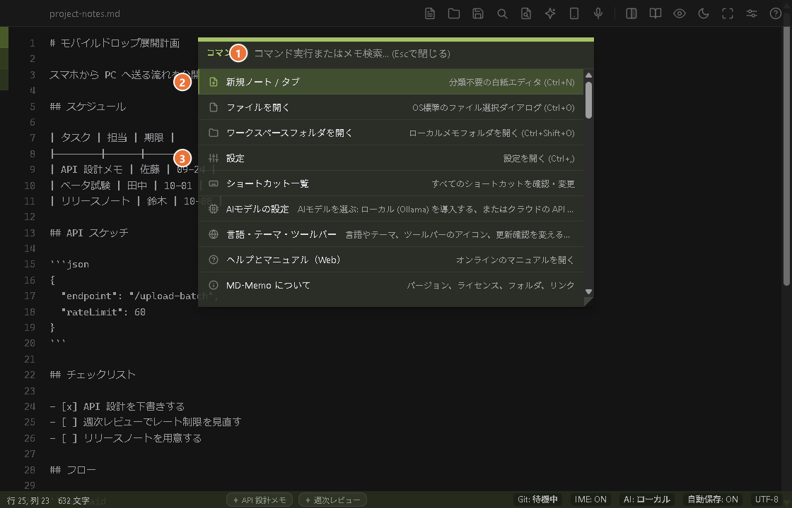
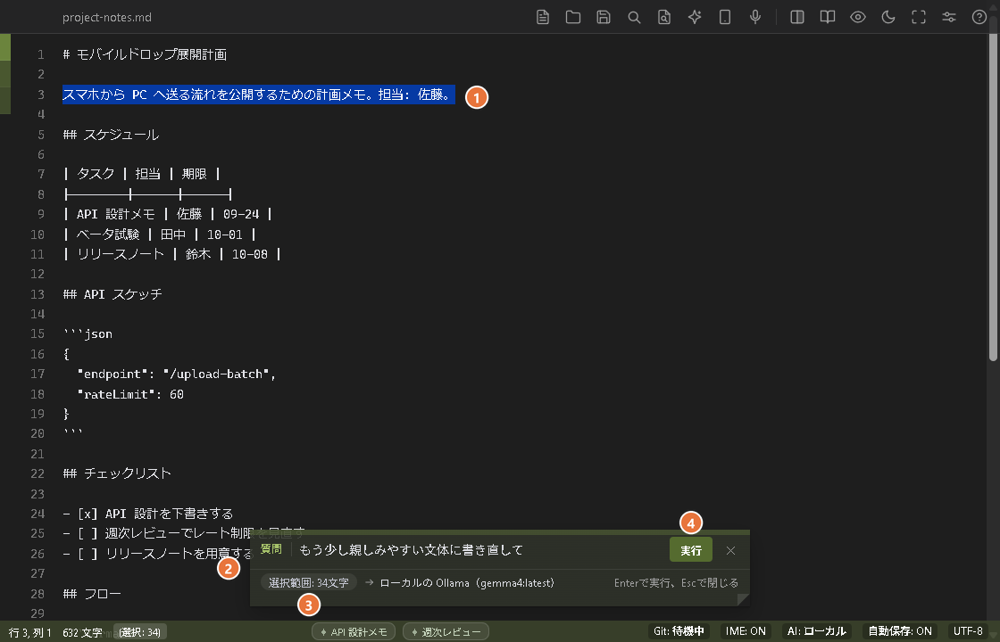
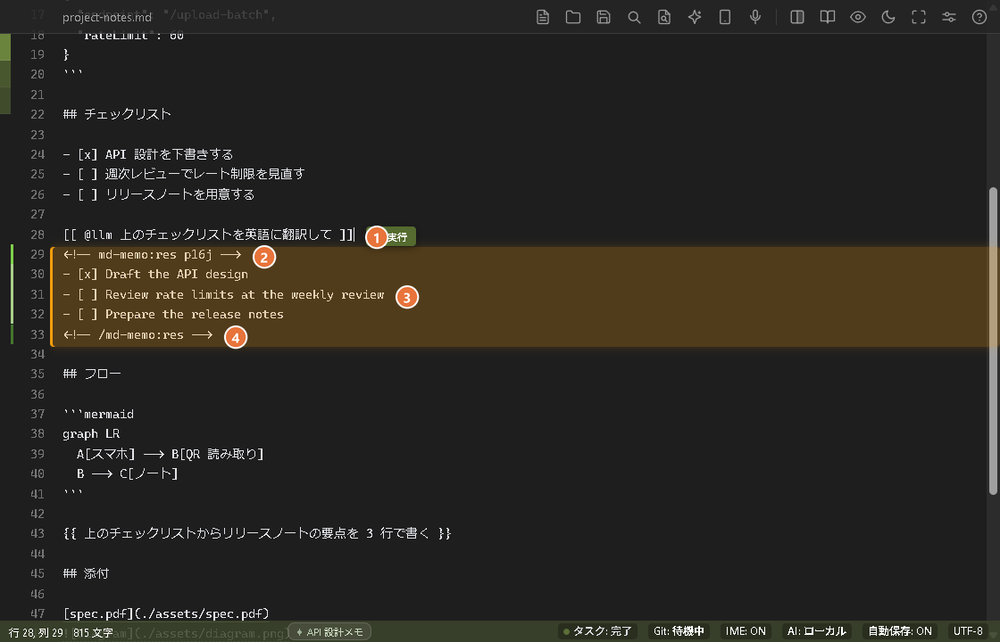

# syki::sok: 機能リファレンス

すべての機能・ショートカット・コマンドラインの詳細な説明です。短い紹介は [README](../README_JA.md) を見てください。

[公式マニュアル・詳細設定ガイド](https://youshinh.github.io/syki-sok/manual_ja.html) • [English Manual](https://youshinh.github.io/syki-sok/manual.html) • [リリースページ](https://github.com/youshinh/syki-sok/releases) • [English (features.md)](features.md)

---

## スクリーンショット・ショーケース

| 左右分割プレビュー & Mermaid 構文図解 (`Ctrl+\`) | コマンドパレット (`Ctrl+Shift+P`) |
|:---:|:---:|
|  |  |

| AIに質問 (`Ctrl+L`) | コマンドバー (`Ctrl+E`) |
|:---:|:---:|
|  |  |

| 自動セレクター (`Ctrl+Enter`) |
|:---:|
|  |

| デイリースクラップ高速並列検索 (`Ctrl+Shift+F`) | 自律エージェント連携 & 実行ポリシー設定 |
|:---:|:---:|
|  |  |

---

## スクラッチパッドの逆説

NotionやObsidianのような巨大なナレッジベースは、長期的な情報整理には極めて優れています。しかし、そのアーキテクチャは本質的に起動遅延と大きなメモリ消費を伴います。一瞬のひらめきを書き留めたい時や、エラーログを急いで貼り付けたい時、2〜5秒の起動待ちは思考の勢いを完全に断ち切ってしまいます。

**syki::sokは保管庫の代替品ではありません。保管庫の「直前に置く、ゼロ抵抗の即時バッファ」です。**

| 比較項目 | 一般的なテキストエディタ | ナレッジ保管庫 (Notion/Obsidian) | syki::sok |
|---|---|---|---|
| **アーキテクチャ** | C++ / Swift | Electron / JVM | **Go 1.26 + OSネイティブ WebView** |
| **起動・復帰遅延** | ~100ms (Cold) | 2.0秒 – 5.0秒 | **&lt; 15ms (トレイ常駐からの瞬時復帰)** |
| **待機時メモリ** | ~15 MB | 400 MB – 800 MB+ | **5 – 15 MB (積極的GCによる圧縮)** |
| **保存モデル** | プレーンテキスト | 内部DB / 独自フォーマット | **100% ローカル POSIX プレーンテキスト** |
| **外部遠隔制御** | プラグイン依存 / なし | 重量HTTPプラグイン | **ミリ秒応答 JSON-RPC 2.0 TCP IPC** |
| **ファイルダイアログ** | OSネイティブ | Node.js IPCラッパー | **Windows: ネイティブ COM `IFileDialog`。macOS: AppleScript経由のシステムファイル選択。** |

> **おすすめ運用法**: syki::sokの保存先を作業中のObsidian Vault（`Daily Notes/` 等）やGitリポジトリに直接指定することで、瞬時メモ端末として機能します。

---

## 迷ったらこの表

AI まわりの機能は「書く」「実行する」「任せる」の3つの動詞に整理されています。それぞれ覚えるべき入口はひとつだけです。AIに質問は `Ctrl+L`、コマンドバーは `Ctrl+E`、任せるは `Ctrl+Enter` です。`Ctrl+Enter` は書いた行の内容から動作を選ぶ「おまかせ」も兼ね、迷ったときは `Ctrl+J` が次の一手を提案します。

| やりたいこと | 入口 | どんな機能か |
|---|---|---|
| **書く** — 選択した文を直したい・書いてほしい | AIに質問 `Ctrl+L` / `Cmd+L` | 内蔵のLLMが選択範囲（なければ現在の行）に対する指示に答え、その結果を数秒で直下に挿入します |
| **実行する** — コマンドを走らせたい | コマンドバー `Ctrl+E` / `Cmd+E`（自分でコマンドを書く。`Tab` でAIモードに切り替えると、日本語で説明するだけでAIが書く） | 選択範囲をシェルコマンドに通し、その出力を下に挿入します（設定で置き換えに変えられます） |
| **任せる** — 調査や実装をまるごと頼みたい。または、行の内容から動作を自動で選ばせたい | 自動セレクター: 行の上で `Ctrl+Enter` / `Cmd+Enter`（`{{ @エージェント 指示 }}` を自分で書いても構いません） | 行の内容から、内蔵LLMに質問するか、外部のエージェントCLI（バックグラウンドで数分かけて作業）に任せるか、コマンドを実行するかを判定し、結果を行の下に書きます |
| **何をすべきか分からない** | `Ctrl+J` / `Cmd+J` | いま書いている内容に合う次の一手を最大3件提案します（アクション候補） |

*(各機能の詳しい使い方は [公式マニュアル](https://youshinh.github.io/syki-sok/manual_ja.html) をご覧ください)*

---

## 設計思想と機能一覧

### 1. 極小フットプリント & サブミリ秒復帰
24時間365日常駐してもPCリソースを圧迫しません。
- **瞬時召喚 (`Ctrl+Alt+M` / `Option+Cmd+M`)**: 重い描画パイプラインをバイパスし、直前のカーソル位置に即座に復帰します。Windowsではシステムトレイから15ms未満で前面化。macOSにはメニューバー常駐アイコンがないため、Dockから前面に呼び出します（Dockアイコンをクリックしても同じ動作です。終了は `Cmd+Q`）。
- **積極的アイドルメモリ回収**: ウィンドウ最小化時やアイドル時に `debug.FreeOSMemory()` を自動発行し、ワーキングセットを5〜15MBまで瞬時に圧縮します。
- **タブは場所を取らない**: 開いているノートは、窓の左端の細い色の帯（6px。いま開いているノートがいちばん濃く、離れるほど薄くなります）です。ポインタを置くか `F6` を押すと本文の上に広がり、名前・未保存の点・`+` が出ます。下の文章は組み直されないので、ノートの負担にはなりません。ノートを2つ並べると各ページに帯が付き、ノートが多いと帯は詰まってスクロールし、「すべてのタブ」のボタンが帯の隣に一覧を開きます。
- **2つのページと仕切り**: `Ctrl+\` でノートを左右に2つ、`Ctrl+Alt+V` でノートの横にプレビューを開きます。2つのノートの間の仕切りは「ノド」で、やわらかい影と、両側へ薄れていくドットでできています。プレビューの横では、ページと机の色の段差だけが仕切りです。ドラッグするか、`F6` を何度か押してフォーカスを仕切りに移し（エディタは `Tab` をインデントに使うため）、`←` `→`（2ポイントずつ、`Shift` で10）、`Home` `End`（左のページをいちばん狭く 15%、いちばん広く 85%）、`Enter`（半分ずつに戻す。ダブルクリックでも戻ります）で幅を変えます。`Esc` で本文に戻ります。半分ずつのとき、2つのページはぴったり同じ幅です。幅は記憶されず、次に起動したときは半分ずつです。設定 → 一般 → 外観 & ウィンドウ →「2つのページの仕切り」で、ノド（既定）・影だけ・細い線を選べます。
- **ネイティブOSダイアログ**: Windowsはネイティブ COM `IFileDialog`、macOSはAppleScript経由のシステムファイル選択を使用します。いずれもElectron風のラッパーなしで瞬時に動作します。

### 2. 自律型 IME シールド (IME Guardian)
日本語入力時の「全角英数誤爆」ストレスを根絶します。
- **レキシカルスコープ保護**: インラインコード（`` `...` ``）、コードブロック、URLの中では全角入力を自動遮断し、11µsの極小オーバーヘッドで半角英数モードへ誘導します。
- **直接入力の自動救済**: 半角直接入力モードのまま「konnitiha」と打ってしまった場合、自動でひらがな変換へ救済します。
- **LLRT言語モデル**: 統計的仮説検定（Log-Likelihood Ratio Testing）に基づく高速判定により、タイピング速度を損ないません。
- **プラットフォームの注意**: WindowsではOSの入力ソースを自動で切り替えます（システム言語が日本語なら既定でオン）。macOSでは入力ソースの自動切替にまだ対応していないため、既定ではオフです。

### 3. 書く・任せる・提案する — ローカルファースト AI
AIは邪魔なチャット画面ではなく、静かな影として寄り添います。
- **書く: AIに質問 (`Ctrl+L`)**: 選択範囲・現在の行・ノート全体（カーソルが空行にあるとき）に対して指示を出すと、内蔵のLLMが数秒でその直下に答えを挿入します。元の文章は置き換わりません。`Alt+C` なら指示を書かずに校正だけ、コマンドパレットには推敲・箇条書き要約・タスク抽出のプリセットも用意しています。
- **ゴーストテキスト（受け身の「書く」）**: ローカルのOllama（Gemma 4 E2B等）やLM Studioと連携し、タイピングを中断しない予測補完を提供。
- **任せる (`{{ 指示 }}`、`{{ @エージェント 指示 }}`)**: ノートに書いた指示を外部のエージェントCLI（Claude Code / Codex / Hermes / Antigravity など）へ委譲します。ブロックの中にカーソルを置いて `Ctrl+Enter`、または完結したブロックの横に表示される **実行** ボタンで開始し、バックグラウンドで実行されます。進行状況はタスクパネル（`Alt+T`）で確認できます。従来の `{{ }}` スロットは、これまでどおり結果で置き換わります。`{{ @エージェント ... }}` の依頼（`agents.yaml` のキー、または `claude` や `cc` のような別名で指名）は、指示の行を残して、結果をその下に入れます。記法・エージェント・別名は `agents.yaml` で自由に追加・変更できます（内部名称: Slot）。権限の確認を飛ばす設定（`--dangerously-skip-permissions` など）のエージェントは、実行前に一度だけ確認します。見直したほうがよいエージェント定義は 設定 → 連携 に表示されます（`agents.yaml` を自動で書き換えることはありません）。使わないエージェントは `agents.yaml` で無効にできます（`enabled: false` または `disabled_agents`）。無効なエージェントは一覧に出ず、選ばれず、ノートで名前を書くと、何も実行せずにその旨を表示します。エージェントのプログラムが PATH に見つからないときも、実行前にその旨を表示し、ノートはそのままにします。自動セレクターをオフにしているときや、行が空白のときは、`Ctrl+Enter` は従来の規則のままです。カーソル位置のスロット、なければその後ろの次のスロット、それもなければノート最初のスロットを実行します。
- **教訓を残す（タスクパネルの「教訓」ボタン、`Alt+T`）**: 任せたエージェントの作業が失敗したり、思った結果にならなかったりしたとき、タスクパネルのカードの **教訓** を押すと、その実行から短い規則を残せます。ダイアログは、まず何を送るか（指示、エージェントの出力の終わり、エラーの文の文字数と、伏せ字にする秘密の件数）と、どこへ送るか（このPCのモデルか、先に許可が要るクラウドのホストか）を見せ、何がまずかったかを書く欄もあります。**提案を作る** を押すと、設定 → AIモデル → テキスト のモデルが、1文の規則を1〜2件提案します。直して、要らないものはチェックを外し、**保存** を押します。規則は、設定フォルダの `lessons/<エージェント>.md` に入ります。1行が1規則（`- 規則 <!-- 日付 -->`）のふつうのMarkdownファイルで、コマンドパレットの **教訓のファイルを開く** で開いて、直したり消したりできます。そのエージェントが任せられたタスク（`{{ @エージェント ... }}`、`{{ }}` の既定のエージェント、`Ctrl+Enter` で任せたもの）を動かすたびに、新しいほうの規則が最大30件（合計4000文字）まで指示の前に付き、タスクのカードに「教訓 N 件を適用」と出ます。`agents.yaml` のエージェントの `lessons: false` で、そのエージェントだけ止められます。自動では何も書かず、ボタンを押すまで何もモデルへ送りません。同じ失敗を繰り返しにくくするためのもので、よりよい結果は約束しません。小さなローカルのモデルはあいまいな規則を書くことがあるので、保存の前に読んでください。考え方は、GEPA（reflective prompt evolution。arXiv 2507.19457）の論文から、「モデルが振り返る、承認する、規則を残す」の1歩だけを取ったもので、自動の最適化はしません。レシピ、`[[ ]]` のタスク、AIへの質問には付きません。
- **教訓: 送るものと、スクリプトから**: モデルへ送るのは、その1回の実行の記録を切り詰めたものだけで、**提案を作る** を押したあとです。指示の先頭（1500文字まで）、出力の終わり（4000文字）、エラーの文（800文字）、あなたの補足（500文字）で、キー・トークン・パスワードは伏せ字にします。ノートのほかの部分は送りません。このPCにないモデルは、ホストごとに一度の許可が要り（「AIに質問」のバー・深掘りと同じ一覧、`general.cloudConsent`）、送る前にもう一度確かめます。秘密を含む規則、コメントの印（`<!--`、`-->`）を含む規則、300文字を超える規則、エージェントの指示を書き換えようとする言い回しを含む規則は断ります。`syki lessons list [--agent <キー>]` と JSON-RPC の `lessons.list` は、ファイルの一覧（規則の数、次の実行で付く数、`lessons: false` かどうか）を読むだけです。**規則を書くコマンドやメソッドは、わざと作っていません**。あると、エージェントが、承認なしに自分の将来の指示を書き換えられるからです。保存した規則は、設定フォルダにあるので、Git 同期にも設定パッケージにも入りません。macOSの実機、スクリーンリーダー、補足欄でのIME入力は、まだ確かめていません。
- **自動セレクター (`Ctrl+Enter`)**: 行の上で押すと、ローカルの決まりごと（ネットワークは使いません）が内容を判定し、内蔵LLMへの指示か、エージェントへの依頼か、コマンドかを選びます。指示の行は残り、結果はその下に、2行のコメントで挟んで書かれます。判定は外れることがあるため、エージェントとコマンドは行を書き換えたところで止まり、もう一度 `Ctrl+Enter` を押すと実行します（`Ctrl+Z` で書き換えを取り消せます。確認は設定でオフにできます）。普通の文章など判断に迷うときは「AIに質問」のバーが開き、ノートは勝手には変わりません。`[[ @llm 指示 ]]`、`[[ $ コマンド ]]`（コマンドバーと同じ安全チェックを通ります）、`{{ @エージェント 指示 }}` を自分で書くこともでき、ひな形（スニペット）は `{{` を入力する、コマンドパレットから選ぶ、`;sum` のような短い語を書いて `Tab` を押す、のいずれかで挿入できます。自動判定は 設定 → 連携 でオフにできます。
- **結果ブロック**: 行の下に書かれた結果は2行のコメントに挟まれ、行番号のガターに緑のバーで表示されます（始まりの行は明るい緑、答えの行は薄い緑、終わりの行は濃い緑。色が付くのはガターだけで、本文には付きません）。コマンドパレットから、次・前の結果ブロックへの移動、コメント行を除いたコピー、削除、確定（本文を残してコメント行を消します。中にある記法は、また実行できる状態に戻ります）ができます。削除と確定は取り消し1回で元に戻せます。どのコマンドにも、設定 → ショートカット でキーを割り当てられます。
- **コメントにする (`Ctrl+/`)**: 選択した行を `<!-- -->` で隠し、同じキーで元に戻します（既定は 1 行ずつ。設定 → 一般 で、まとめて 1 つのコメントにもできます）。コメントの中身はプレビューに表示されず、中のタスク・スロット・承認ゲートは実行されません。カーソルがコメントの中にあるときの `Ctrl+Enter` は何もしません。
- **アクション候補 (`Ctrl+J`)**: いま書いている内容から次の一手を最大3件提案。各カードは「書く」「実行」「任せる」のいずれかに対応します。`Ctrl+1`〜`3`（macOSは `Cmd+1`〜`3`）でカードを実行、`Ctrl+Tab` で移動して `Enter` で決定できます。ステータスバーの **AI** をクリックすると、**提案** のスイッチで ON / OFF、**Ctrl+J を押したときだけ** で手動に切り替えられます。既定では内蔵のローカル規則だけで動作し、ノートの内容は外部に送信されません。APIキーやカスタムエンドポイントを設定した場合に限り、カーソル周辺の約2,000文字が外部の推論モデル（Jev など）へ送られます（内部名称: System 1 / 3-Beam / MAP-Elites）。
- **決定論的 AST ガードレール**: 候補として提示されたシェルコマンドは、実行前にAST構文検証エンジンでチェック。`rm -rf /` などの破壊的コマンドやシステム領域への書き込みを検出すると実行を拒否します。
- **思考トークンの自動除去**: DeepSeek等の推論モデルが出力する `<think>` タグを、描画前に透過的にクリーニングします。

### 4. UNIX パイプライン & CLI 自動化
メモ帳を標準入出力のストリームとして扱えます。
- **CLI パイプ入力 (`cat log | syki`)**: ターミナルの出力を実行中インスタンスへミリ秒転送し、当日のデイリースクラップ（`scraps/YYYY-MM-DD.md`）へ即座に追記。
- **コマンドバー (`Ctrl+E`。`Tab` で CLI / AI モードを切り替え)**: 1つのバーに2つのモードがあり、`Ctrl+E` で前回使ったモードのまま開きます。CLI モードでは、選択範囲（選択がなければノート全体）を `jq`, `sort`, `tr`, `prettier`, `duckdb` などのローカルコマンドに流し込みます。出力は選択範囲の直下に挿入され、選択範囲は残ります（設定 → 連携 → コマンドで、選択範囲を置き換える動きにも変えられます）。既定では結果タブにも開きます。選択がなければ結果タブだけが開きます。AI モードでは、やりたいことを日本語で入力すれば、コマンドを入力欄に書いてくれます。バーは CLI モードに戻るので、内容を確かめて（危険なコマンドには安全性チェックの警告が付きます）Enter で実行します。バッジをクリックしてもモードを切り替えられます。

### 5. 高速並列スクラップ検索 (`Ctrl+Shift+F`)
- **CPU全コア並列スキャン**: `runtime.NumCPU()` のワーカースレッドと `bufio.Scanner` により、数年分の過去スクラップを150ms未満で高速Grep検索。
- **ダイレクトジャンプ**: 検索結果をクリックまたはEnterキーで、該当行へスムーズスクロール＆ハイライト。
- **選択やカーソル語で開始・引用**: `Ctrl+Shift+F` は、選択していた文字（なければカーソル直前の単語）を最初から検索した状態で開きます。結果の上で `Tab`（または `Shift+Enter`）を押すと、ファイルを開く代わりに、その行がカーソル位置へ挿入されます（`Ctrl+Z` で取り消し可）。`Ctrl+F` も、選択した文字から始まります。
- **期間とタグで絞り込む**: 入力欄の下の **絞り込み** ボタンで、**期間**（すべて・今日・7 日間・30 日間・今月）と **タグ**（複数選ぶと、そのすべてを持つものだけ。同時に 8 個まで）を選べます。完全一致・意味・**深掘り**のどれにも同じ絞り込みがかかり、深掘りは、画面に出ている絞り込み後の一覧の抜粋だけを送ります（絞り込みの外のノートの文章は、隣にあるものも送りません）。期間は **ファイル名の先頭の日付**（`2026-09-27.md`、`2026-09-27_題名.md`）で決まり、日付のないノートはどの期間にも入りません（その件数が画面に出ます）。選んだ絞り込みは、アプリを開いている間だけ覚えます。タグの一覧は **絞り込み** を開いたときに初めて読むので、使わなければ何も読み込まず、絞り込みなしの検索はこれまでと同じ速さです。
- **タグの書き方**: ノートの中に、1 行の HTML コメント `<!-- tags: 仕事, 買い物 -->` で書きます（プレビューにも印刷にも出ません）。最初の見出し（`#`〜`###`）か `---` の区切り線より上に書くとノート全体のタグになり（先頭の YAML フロントマターの `tags:` も同じで、syki::sok は読むだけです）、それ以外の場所に書くと、そのコメントがある 1 件（見出しか `---` で分かれる、検索が数える単位）と、**その見出しの下に続く小見出しすべて**のタグになります（同じ段か上の段の見出し、または次の `---` が来るまで。`#` の次にいきなり `###` が来てもかまいません。`####` 以下は区切りではなく、上の 1 件の文章の一部です）。見出しの下に貼ったウェブ記事が、記事自身の `##` や `###` で何件にも分かれていても、上の見出しの下の 1 行で全部に付き、そのタグで絞れば記事のどの節も見つかります。同じ段の別の見出し、上の見出し、`---` より下には効かないので、1 つの節だけに付けるときは、その節の見出しの下に書きます。ヒットがタグを持つのは、その 1 件か、上の見出しか、ノート全体が持つときで、タグの一覧の件数も、見出しの下のタグが届く 1 件を数えます。コードブロックの中、行の途中、複数行にまたがるコメントは読みません。手で書くほか、次の項目のコマンドでも付け外しできます。
- **タグを付ける・外す**: コマンドパレット（`Ctrl+Shift+P`）で「タグ」と打つと、**この書き込みにタグを付ける**・**ノート全体にタグを付ける**・**タグを外す** の 3 つが出ます。エディタの右クリックメニューの「音声入力」の下にも、同じ 3 つがあります（専用のショートカットはありません）。作業しているペインのノートに働き、書き込みは、カーソルのある行（右クリックは、クリックした位置にカーソルが移ります）のものです。複数の行を選んでいるときは、選択の最初の行と最後の行がどちらもその下にある、いちばん近い見出しが対象で、貼ったウェブ記事を丸ごと選んで実行すれば、記事全体に付きます。入力欄と一覧の小さなパネルが開き、付けるときは、一覧にフォルダのタグが、使っているノートの多い順に（件数つきで）並び、打ったタグは「新しいタグ: ○○」として先頭に出ます。カンマ・読点・セミコロン・空白で区切ればまとめて打てます（1 回に 8 個まで、1 個 64 文字まで。先頭の `#` は取ります）。先に 1 行の中の 1 語（200 文字以内。先頭の `#`、引用符、括弧、前後の句読点は取ります）を選んでおくと、その語が入力欄にはじめから入って全体が選ばれ、そのまま `Enter` で付き、打ち始めれば置き換わり、`Backspace` で空になります（付けるときだけ。2 語以上や複数行の選択は入れません）。`Enter`（または `Tab`、クリック）で付き、`Esc` で閉じます。書き込みの上に見出しがあるときは、一覧の上に「付ける場所」の行（外すときは「外す場所」）が出て、その書き込み自身の見出しと、その上の見出しが、行の範囲つきで並びます（「加工（10〜13 行）」のように）。クリックするか、`Ctrl+↑`（上の見出し）・`Ctrl+↓`（下へ戻る）で選ぶと、タグは選んだ見出しのすぐ下に入り、その下すべてに効きます（パネルの上の表示が「書き込みと、その下すべて（3 個の書き込み）3〜15 行目」のように変わり、ステータスに「その下の N 個の書き込みにも効きます。」が加わります）。選べるものがないときは、この行は出ません。Mac では `Ctrl+↑` が Mission Control のショートカットなので、クリックで選びます。外すときは、選んだ見出しに書かれたタグ、上の見出しから届いているタグ（「「見出し」（N 行目）から」と添えられ、選ぶとその見出しから外れます）、ノート全体のタグが並びます。書かれるのは 1 行の `<!-- tags: a, b -->` だけで、書き込みなら見出しのすぐ下、ノート全体ならノートの最初の行です。その範囲にタグの行がすでにあればそこに足し、外して空になった行は消えます。すでにあるタグ（ノート全体や上の見出しのタグとして届いているものも含む）は重ねて書かず、ほかの文章（改行の形や BOM も）は変えません。取り消しは `Ctrl+Z` 1 回で、変わった行には変更箇所の帯が一瞬出ます。できないときは、その理由を 1 行で伝えて、何も変えません。先頭が YAML フロントマターのノートには、ノート全体のタグは付けられず（書き込みに付けるか、`tags:` を自分で書きます）、フロントマターだけにあるタグは外せません。反対側の範囲にあるタグは、どちらにあるかを伝えます。上の見出しからしか届いていないタグは、その節そのものからは外せず、ステータスにどの見出しの何行目に書かれているかを出します（その見出しから外します）。`Ctrl+/`（コメントアウト）は、タグの行に触れません。AI によるタグの提案、たくさんのノートへのまとめ付け、タグを別の見出しへ付け替えること（外して付け直します）は、まだありません。
- **コマンドと JSON-RPC から**: `syki scrap search ... --tag 仕事,急ぎ`（繰り返し可、8 個まで。普通の検索・`--ranked`・`--semantic` のどれとも組めます）と、`syki scrap tags`（書かれているタグと、使っているファイルと件の数、読んだファイルの数、名前に日付のないファイルの数）が使えます。タグの付け外しは、`syki scrap tag add|remove <タグ> [<ファイル>] [--line N] [--write] [--json]` と `syki scrap tag show [<ファイル>] [--line N]` です。新しい本文を標準出力に出し（ファイルを省くと標準入力から読みます）、`--write` を付けたときだけファイルを書き換えます（読んだあとにファイルが変わっていたら書かず、ファイルを新しく作ることもありません）。`--line` を省くとノート全体、`--line N` を付けると N 行目を含む書き込みと、その見出しの下すべてが対象です（N はその節のどの行でもよく、貼った記事の全体に付けるときは記事の先頭の見出しの行を渡します）。`show` は「tags it gets from the headings above」の行も出し、上の見出しからしか届いていないタグを外そうとすると、その見出しと行を伝えて断ります（終了コード 1）。JSON-RPC は、`scrap.search` の `tag`（`"a,b"` か配列）と、新しいメソッド `scrap.tags`、タグの付け外しを計算する `scrap.tag_edit` です。`scrap.tag_edit` は、送ったテキストから計算するだけで、ファイルにも画面にも触れません（`range_start`・`range_end` は書き込みと、その見出しの下すべてを含み、答えには `descendants`、`inherited_tags`、`path`（その書き込みと上の見出しを近い順に並べたもの。タグを付けられる場所）、そして新しい `message_code` の `on_parent` のときの `parent_heading`・`parent_line` も入ります。行番号はすべて古い本文のものです。開いているノートには、`buffer.get` → `scrap.tag_edit`（`return_text` つき）→ `buffer.set`（`expected_hash` つき）の順に使います。`buffer.replace_all` は検索と置換なので使えません）。`--from`・`--to` も、`2026-09-27_題名.md` のように名前が日付で始まるノートを、日付のあるものとして扱います。検索結果に出る前後の行から、タグのコメントの行は除かれます。

### 6. バックグラウンド Git 自動同期
- **サイレント同期**: アプリ起動時に `git pull --rebase` を実行し、編集後30秒アイドルが続くと自動で `git add/commit/push` をバックグラウンド処理。
- **1クリック初期化**: 設定画面でGitHub等の空リポジトリURLを入力するだけで、自動でローカルGitリポジトリを初期化・紐付けします。
- **設定パッケージ**: 設定・エージェント定義・このプロジェクトのスキルを1つの `.sykipack` ファイルに書き出し（設定 → エクスポート...）、別のPCで読み込めます（設定 → インポート...）。APIキーは **API キーを含める** にチェックを入れない限り含まれず、上書きされるエージェント定義とスキルは先にバックアップされます。読み込んだパッケージが、文章の送り先や確認なしで動くものを黙って変えることはありません。モデルの新しいサーバーのアドレス、オフにされるエージェントの実行前確認、Discord 連携、ホットフォルダは、**読み込む** のあとに一覧で示され、チェックを付けたものだけが反映されます。

### 7. Mobile Drop — スマホから送る (`Ctrl+Shift+U`)
QRコードを読み取るだけで、スマホの写真・ファイル・ボイスメモ・テキストを、開いているメモへ直接送れます。アプリもアカウントも不要です。

<p align="center"></p>

- **送信トレイ**: 写真・ファイルを最大10件（合計60MBまで。1件あたり画像20MB・音声25MB・テキストファイル2MBまで）追加し、ボイスメモを録音し、テキストを入力して、1つの**「まとめてPCへ送信」**ボタンで送信できます。写真はOCR、ボイスメモは文字起こし、テキストファイルは追記されます。スマホ側で作業（ファイル追加・録音・入力）している間はセッションが維持されるため、バッチ作成中に下記のアイドルタイムアウトにはかかりません。各項目は個別の見出し `## Mobile Drop [14:20:05] — <ファイル名>` の下に入り、処理できない項目が1つあっても残りの送信は止まりません。
- **双方向のテキスト共有**: PCで選択中のテキスト（選択がなければクリップボードのテキスト）がワンタップコピー付きでスマホのページ上部に表示され（2秒ごとに更新、最大64KB）、PC側のダイアログにも共有内容が80文字に切り詰めて表示されます。
- **既定はローカルのみ**: 同一LAN上で一度きりのサーバーを起動します（ランダムな使い捨てトークン。リクエスト本体を読む前にチェックされます。1回の送信、または60秒間操作がないと自動終了）。ネットワークの外には出ません。
- **写真はテキストに**: 写真は、`Ctrl+V` の画像OCRに設定したビジョンモデルで文字起こしします（ローカルのOllamaやLM Studioのモデルならキーは不要です）。クラウドのモデルを設定している場合は、貼り付けと同様にそのプロバイダーへ画像が送られます。
- **失われません**: OCRや文字起こしが未設定の場合、または何らかの理由（APIキー未設定・非対応モデル・空の文字起こし結果・ネットワークエラー・タイムアウトなど）で失敗した場合でも、写真やボイスメモは貼り付け画像と同じように、メモの隣の `./assets/` へ保存されてリンクされ、リンクの下に理由が1行付きます（写真は ``、ボイスメモは `[name](./assets/...)`）。理由の行はUI言語に関わらず日本語で、何件を保存したかがトーストで知らされます。ファイルの保存まで失敗した場合に限り、インラインの `[Mobile Drop: <ファイル名> の処理に失敗しました: <エラー>]` が入ります。
- **スマホ側の堅牢性**: カメラ・ファイル選択・録音アプリへ切り替える直前に、ページがPCへセッションの延長（最大120秒）を依頼するため、録音アプリを開いている間に60秒のアイドル制限でセッションが終わることはありません。送信に失敗した場合は、PC側のセッションが生きていれば1回だけ自動で再送し、そうでなければPCとの接続が切れている（閉じたか時間切れ）ことを知らせ、PCでMobile Dropを開き直してQRコードを読み取り直すよう案内します。
- **位置情報は任意（トンネル使用時のみ）**: Cloudflareトンネル経由（HTTPS）のときだけ、スマホは位置情報を1回だけ、1度限りの試行として添付でき、最初の項目の見出しだけが `## Mobile Drop [14:20:05] — <ファイル名> (34.693, 135.502)` のようになります。通常のLAN（HTTP）では要求も添付もしません。
- **外部ネットワーク（任意）**: ダイアログのボタンで [Cloudflare Quick Tunnel](https://developers.cloudflare.com/cloudflare-one/connections/connect-networks/do-more-with-tunnels/trycloudflare/) に切り替えると、LTEや別のWi-Fiからも送れます。トンネル経由ではページ内でのボイスメモ録音も使えます（通常のLANではスマホ本体の録音アプリが開きます）。`cloudflared` のインストールが必要で、送信内容はCloudflareのサーバーを経由します。

### 8. スマート貼り付け (`Ctrl+V` / `Ctrl+Shift+V`)
クリップボードの中身に応じて使い分ける2つの貼り付けショートカットです。
- **`Ctrl+V` はMarkdownにして貼る**: Webページ・Word・Google Docs・Excelの、構造のある `text/html` を内蔵コンバータでMarkdownに変換します（見出し・リスト・列揃え付きの表・タスクチェックボックス・コードブロックなど）。安全のため `script`・`style`・`iframe`・`svg` の中身と `javascript:`・`data:` リンクは除去します。構造のないHTML（エディタやターミナルからのコードとログ、1セルだけのコピー）は、そのまま貼ります。クリップボードに画像しかない場合は、ビジョンOCRでMarkdown/Mermaidに変換します。OCRがオフのとき、またはAPIが未設定のときは、画像を `./assets/` に保存してリンクで貼ります（`Ctrl+Shift+V` やMobile Dropと同じ）。理由はメッセージに出ます。
- **`Ctrl+Shift+V` はそのまま貼る**: 加工しないプレーンテキストを貼ります。画像のみのクリップボードは `./assets/`（拡張子は画像形式に合わせる）へ保存してリンクし、OCRには送りません。ExcelやWordのようにテキストと画像が両方乗っている場合は、テキストを貼り付け、画像は無視します。
- **設定 → 一般**: 「Ctrl+V で Web・Word・Excel の内容を Markdown にして貼る」（既定でオン）。オフにすると、以前の割り当て（`Ctrl+V` がプレーン、`Ctrl+Shift+V` が変換）に戻ります。

### 9. 音声入力 (`Ctrl+Shift+R`)
押すと録音を開始し、カーソル位置のマーカーで録音中・文字起こし中の状態が分かります。既定のモデルはGoogleの `gemini-3.5-transcribe` で、Interactions API に `store: false` を付けて呼び出すため、録音も文字起こし結果もGoogle側には保存されません。`gemini-2.5-flash` などの従来モデルも generateContent 方式でそのまま使えます。
- **好きな方法で開始**: ショートカット（既定は `Ctrl+Shift+R` / `Cmd+Shift+R`。設定 → ショートカットで変更できます）、ツールバーのマイクボタン、右クリックメニュー、コマンドパレットのいずれかで開始します。録音中は画面の左下に経過時間の表示が出て、**停止** ボタンで録音を止めて文字起こしを始められます（ショートカットをもう一度押すのと同じです）。`Esc` を押すと破棄します。
- **設定（設定 → AIモデル → 音声入力）**: モデル、API 形式（自動 / Interactions API / generateContent）、言語コード（例: `ja-JP, en-US`。空欄なら自動判定で、言語が混在していても使えます）、モード（スマートは言い淀みを除いて整形し、逐語は一言一句そのまま）、カスタム語彙、無音タイムアウト。APIキーとベースURLは画像OCRの設定を使います。
- **話した内容を整える・声で書き換える**: 文字起こしのあと、2 段目のモデル（`gemini-flash-lite-latest`）がフィラーや言い直しを取り除き、いまの行の書式（箇条書き・タスク・表）に合わせます。テキストを選択して話すと、話した内容を編集の指示として選択範囲に適用します。既定でオンで、`Ctrl+Shift+Alt+R` はその 1 回だけ整えずに入力、`Ctrl+Alt+R`（またはステータスバーの **AI** の中の **音声の整形** スイッチ）でオン/オフを切り替えます。失敗したときや遅いときは、文字起こしをそのまま入れます。
- **失敗時の救済**: 文字起こしに失敗した場合は、音声を保持したまま再試行・保存・破棄をワンクリックで選べます（アプリを再起動しても機能します）。

### 10. ファイルリンク & ドラッグ&ドロップ
エディタの文章上にファイルをドロップすると、カーソル位置にMarkdownリンクが挿入されます（画像は ``、それ以外は `[name](...)`）。組み込みブラウザは元のパスを取得できないため、ファイル（最大25MB）は `./assets/` にコピーされます。`Ctrl+クリック` でOS既定のアプリで開き（Webのアドレスはブラウザで開きます）、`Alt+クリック` でファイルをエクスプローラー / Finder に表示します。エディタ内のリンク（Markdownのリンク、画像、`http://` / `https://` で始まるそのままのアドレス）には下線が付くので、クリックできる場所が分かります（画像は点線で、カーソルを重ねるとプレビューも出ます）。`mailto:` などそれ以外の形式には下線が付かず、エディタから開くこともできません。非常に大きなノート（10万文字超）では下線を省きますが、Ctrl+クリックは使えます。行番号は各行の最初の表示行に付き、折り返した行は1つの番号のまま、続きの表示行は空欄になります（12万文字を超えるノートでは、従来どおり単純な 1〜N の番号です）。

### 11. Discord連携 — 閉じていてもどこからでも取り込める
自分のDiscord Botへスマホからメッセージを送ると、次にsyki::sokを起動したときに今日のスクラップへ入ります。送った時にアプリが閉じていても構いません。

- **ホスティングもアカウントも不要（Bot以外は）**: Mobile Dropと違い、起動するサーバーも同じネットワークにいる必要もありません。syki::sokはBotの当人DMを、外向きのHTTPS通信だけで定期的に確認します（既定45秒間隔）。受信用のポートも中継サーバーもCloudflareアカウントも一切不要で、必要なのは[Discord Developer Portal](https://discord.com/developers/applications)で自分で作る無料のBotと、それを自分がいるサーバーに1つ招待すること（DiscordはBotと1つもサーバーを共有していない相手へのDM開始を許さないため。自分専用の非公開サーバーで十分で、スラッシュコマンドの登録も継続的な活動も不要）だけです。
- **閉じている間も待っていてくれる**: syki::sokが動いていない間に送ったメッセージも、Discord側の履歴にそのまま残っています。次に起動したときの最初の確認で、前回確認した時点からの分をまとめて取り込みます。
- **本人だけ**: 連携する1つのDiscordアカウント（ユーザーID）からのメッセージだけを受け付け、送信者を毎回照合します。それ以外からのメッセージは無視されます。
- **Mobile Dropと同じ処理経路**: 写真はOCR、ボイスメモは文字起こしを、設定済みのビジョン/音声設定でそのまま行います。失敗した場合は、Mobile DropやCtrl+Vと同様に理由付きで `./assets/` にファイルとして保存されます。
- **設定 → 同期 → 「Discordからの入力」**: Botトークンと自分のDiscordユーザーIDを貼り付けて有効化し、**接続テスト**で確認してから使えます。

### 12. クイックキャプチャ & 画面キャプチャ（Windowsのみ）
アプリを開かずに書き留められる、常に最前面の小さなポップアップです。入力欄と、**Send**・**AI Send**・**Capture** の3つのボタンがあります（ボタンの表記はどのUI言語でも英語です）。
- **クイックキャプチャ (`Ctrl+Shift+Q`)**: グローバルホットキー（設定 → ショートカットで変更・解除できます。他のプログラムがすでに使っている組み合わせは拒否されます）、ツールバーのボタン、トレイメニュー、コマンドパレットから開きます。`Enter`（Send）は入力したとおりのテキストを今日のスクラップに追記し（入力欄が空ならクリップボードのテキスト）、`Ctrl+Enter`（AI Send）は `Alt+C` と同じAIで先に校正してから追記し、`Esc` で閉じます。ホットキーで開いてAI校正つきで追記したときは（通常の送信は入力した文字だけです）、エントリーの先頭に、直前まで使っていたウィンドウのタイトルを示す `> [context: <ウィンドウのタイトル>]` の行が付きます。フォーカスを失って1秒たつと、ポップアップは自動で閉じます。
- **画面キャプチャ (ポップアップで `Ctrl+Shift+Enter`、または Capture ボタン)**: 選ぶまで画面は一切読み取りません。ウィンドウにカーソルを重ねてクリックするか、範囲をドラッグします。`Ctrl` を押したまま選ぶと複数をまとめて選べ、`Ctrl` を離すと全部を取り込みます。`Esc` か右クリックで取り消します。取り込んだ画像はPNGとして `assets/` に保存されて今日のノートにリンクされ、選んだ順にOCRで文字が読み取られます（OCRエンジンは次の節）。既定では画像は画像OCRに設定したビジョンモデルへ送られ、**画像をこのPCの外に出さない**（設定 → 同期 → ホットフォルダ）をオンにするとPC内だけで読み取ります。
- macOS: どちらもまだ使えません（ツールバーのボタンもショートカットの行も表示されません）。

### 13. ホットフォルダ — 画像と音声がそのままノートに（Windows / macOS）
設定 → 同期 → **ホットフォルダ** でオンにします（既定はオフ。既定のフォルダは `~/Documents/syki-sok/inbox`）。すでに置かれているファイルは起動時に1回だけ処理し、以降は新しく届いたものを順に処理します。
- **動作**: 画像（`.png .jpg .jpeg .bmp .gif .webp`）はOCRで文字を読み取り、引用とリンクとして今日のノートに追記します。音声（`.mp3 .wav .m4a .ogg .flac`）は文字起こしして、時刻とリンク付きで追記します。処理したファイルはスクラップ横の `assets/` へ移動し、OCRや文字起こしに失敗しても削除しません（代わりに理由が1行、ノートに入ります）。
- **OCR**: まず 設定 → AIモデル → 画像OCR のクラウドのビジョンモデルで読み取り（精度が大幅に高いため）、失敗したときだけ端末内エンジンを使います。**画像をこのPCの外に出さない** をオンにすると端末内エンジンだけで読み取り、画像を外部へ送りません（精度は下がります）。macOSには端末内OCRエンジンがないため、画像はクラウドのビジョンモデルだけで読み取られ、このオプションは表示されません。
- **文字起こし**: 既定は Gemini です。Windows（x64）では 設定 → AIモデル → 音声入力 → エンジン で **Whisper（このPC内・オフライン）** に切り替えられます。Whisper 本体（約9MB）とモデル（既定は日本語に特化した kotoba-whisper で約513MB。多言語版・軽量版や、手元のファイル／URLも使えます）はこの画面から必要なときにダウンロードし、Gemini での再試行をオンにしない限り音声は外部へ送りません。エンジンはフォルダ監視とDiscord連携に適用され、画面での音声入力とMobile Dropは引き続きGeminiを使います。macOSでは音声はGeminiだけで文字起こしされます。
- **フォルダを開く**: ホットフォルダがオンの間、トレイメニューの **Open inbox folder**（Windows。表記は英語）、またはコマンドパレットの **受信フォルダを開く**（両OS）で開けます。

### 14. 「送る」と `syki ocr` — ウィンドウを開かずに画像を文字に
- **Windows、「送る」**: 設定 → 連携 → **OS連携 (送る)** の「追加」で、エクスプローラーの「送る」メニューに **syki::sok (OCR)** が入ります（「解除」で元に戻ります）。画像を右クリック → 送る → syki::sok (OCR) を選ぶと、文字が今日のノートに追記され、ウィンドウは開きません。
- **ターミナル、WindowsとmacOS**: `syki ocr <画像>` で同じことができます（`--json` でJSON出力。syki::sokを起動していなくても使えます）。画像OCRの設定とスクラップのフォルダは `config.json` から読み、ノートのパスを表示します（文字がなければ `(no text recognized)`）。macOSではクラウドOCRのみです。

### 15. 意味検索と深掘り（試験的機能・初期設定はオフ）
- **意味で探す**: **設定 → AIモデル → 意味検索**（タブの最後の節）でオンにします。スイッチを入れると、いつものローカルのモデル（Ollamaの `bge-m3`）が入力されます。クラウドの埋め込みモデルは、API キーと、そのホストへ送る許可（出てくるチェック）が要ります。そのあと **今すぐ更新** を押して索引を作ります（コマンドの `syki scrap index` でも、`config.json` に `"semantic": {"enabled": true, "model": {...}}` を書いても同じです）。この節には、ノートの送り先（このPCかクラウドのホストか）、索引がどれだけ遅れているか、**今すぐ更新**（進み具合と **中止** ボタンつき）、**作り直す** が出ます。ノート検索（`Ctrl+Shift+F`）に **完全一致 | 意味** の切り替えが出ます。「意味」は、言葉ではなく内容でノートを探します（「環境にやさしい建材の話」で竹のノートが見つかります）。日本語、英語、混在のどれでも使えます。表示は10件（**さらに表示**で30件）で、最良のものより大きく点数が低いものは除きます。最後に `syki scrap index` を実行したあとに書いたノートは、再度実行するまで単語で探します。同じ検索は `syki scrap search --semantic` と JSON-RPC の `scrap.search` でも使えます。
- **深掘り**: 「意味」モードの **深掘り** ボタン（または `Ctrl+Enter`）は、ヒットした各ノートの前後の文章を抜き出し、まず確認を出します（何件・何文字を、どのモデル（このパソコンかクラウドか）に送るか、何を除いたか）。絞り込みをしているときは、画面に出ている絞り込み後の一覧の抜粋だけを使います（短い抜粋に足す隣の文章も、絞り込みに合うものだけです）。**実行** すると、設定 → AIモデル → テキスト のモデルに送り、答えを **新しい未保存のタブ** に出します。答えには出典の番号（[1]、[2]）が付き、引用した原文の数行が並びます（その出典に見つからない引用には「(未検証)」が付きます）。最後に、各ノートへのリンクつきの出典の一覧が付きます（`Ctrl/Cmd+クリック` で開きます）。AIにリンクは書かせず、AIが作ったリンクは取り除きます。
- **プライバシー**: 索引はこのパソコンの中（スクラップのフォルダの外）にあり、Gitでは同期しません。このパソコンにないモデルへは、そのホストを許可するまで何も送りません（AIモデルは深掘りの確認画面で、埋め込みモデルは `config.json` の `semantic.privacy.cloudConsent` で許可します）。`.syki-sok-ignore` に書いたファイル、隠しフォルダ、AIの結果ブロック、以前の深掘りのノートは送りません。抜き出した文章にキー、トークン、パスワードがあれば、送る前に伏せ字にします。ノート検索で絞り込み（期間・タグ）をしているときは、その絞り込みに合う抜粋だけを送ります。設定パッケージ（エクスポート／インポート）に `semantic` は含まれません。同じ設定のテキストモデルは、**教訓**の提案にも使います。**提案を作る** を押したときだけ、指示・出力・エラーの抜粋（キーなどは伏せ字）をそのモデルに送り、このパソコンにないホストには、同じ許可を求めます。
- **スクリプトやエージェントから**（JSON-RPC、セッショントークン付き。詳細は `skills/syki/references/interfaces.md`）: `deepsearch.plan {query}` は深掘りの下見で、どのノートを何文字使い、モデルがこのPCか許可済みのクラウドかを答えます。何も送らず、何も残しません。`ui.open_panel {name: "scraps_search", mode: "meaning", query}` は、ノート検索を意味モードでその文で開いて検索まで実行し、**深掘り**ボタンは人が押します。深掘りそのものを実行するメソッドはありません（ノートをモデルへ送るため）。

### 16. プレビューを印刷・PDFで保存（Windows）
- **プリンターのボタン**（プレビューの右上、「プレビュー」の札の左。エディタの横に開いたプレビュー（`Ctrl+Alt+V`）では、そのペインのヘッダーにあり、そのペインが見せているノートを印刷します）を押すと、syki::sokの見た目の印刷パネルが開きます。左に印刷したときのページ（用紙のまわりに灰色の余白付き）、右に設定です。**用紙**（A4・A3・B5・Letter）、**向き**、**余白**（標準は20mm、狭いは10mm）、**拡大・縮小**、**ページ**（例: `1-3, 5`）、**ヘッダーとフッター**のスイッチがあり、変えるたびにプレビューが作り直されます。**PDFに保存**は保存先を聞いて（ノートの名前が初期値）、プリンターもドライバーも使わずにPDFを書き出します。**プリンターで印刷...** はプリンター向けのシステムの印刷画面です。
- **ヘッダーとフッターは初期ではオフ**です。オンにすると、上にノートのファイル名、下に保存場所（フォルダー）、右下にページ番号が入ります（まだファイルになっていないノートは「（未保存のノート）」）。設定は次回も覚えます（ページの指定だけは覚えません）。
- **テーマに関係なく、紙向きの見た目**: 印刷されるのはプレビューだけです（タブ、ツールバー、ステータスバーは出ません）。白い紙に黒い文字で、見出し、引用、コード、表は黒と灰色の罫線になります。画像はカラーで印刷します。画像や図はページの幅を超えず（小さいものは拡大しません）、1ページの高さも超えず、途中で切れずに次のページへ丸ごと移ります。ダークトーンのMermaidの図は、印刷のあいだだけ明るいトーンで描き直し、終わると元に戻ります。コードは折り返し、表の行は切れず、画像の説明の行は画像と同じページに付きます。縦のページより幅の広い図は、ページの幅に縮みます。印刷画面で「横」を選ぶと大きくなります。
- 使うまでは負担がありません。スタイルシートは印刷のときだけ効き、スクリプトは最初にボタンを押したときに読み込みます。パネルを開いているあいだはPDFビューアーが作業メモリを約170MB使い（WebView2のプロセスが2つ増えます）、閉じると返し、PDFは残しません。
- **スクリプトやエージェントから**（Windows）: `syki tab pdf notes.md -o notes.pdf` で、起動中のアプリがそのノートのPDFを作ります（**PDFに保存**と同じページ。`--paper a3`、`--landscape`、`--margin narrow`、`--scale`、`--pages 1-3,5`、`--header-footer` が使え、`-o` を省くとノートの隣に出し、`--overwrite` なしでは既存のPDFを置き換えません）。ノートは一瞬だけ裏のタブで開いて閉じ、ファイルを指定しなければアクティブなタブ（`--tab <id>` で別のタブ）を印刷します。JSON-RPCは `print.pdf` です。プレビューを出すあいだ、画面が一瞬ちらつきます。
- **macOSでは**、同じボタンがパネルの代わりにmacOS標準の印刷画面を開きます。左下の **PDF ▾ → PDFとして保存** で保存でき（ファイル名の初期値はノートの名前）、プリンターを選んで印刷もできます。用紙、向き、拡大率はその画面で選びます。余白は20mmで、ヘッダーとフッターは付きません（WKWebViewでは付けられません）。macOS 11以降が必要です。実際のMacでの確認はまだです。

### WindowsとmacOSの違い
WindowsとmacOSは同じコアを共有しており、上の各節にあるプラットフォームの注意（瞬時召喚・IME Guardian・ファイルダイアログ）はそのまま当てはまります。新しいキャプチャ系の機能は次のように違い、「なし」「非表示」とした項目は、いまのところmacOSでは使えません。

| 機能 | Windows | macOS |
|---|---|---|
| クイックキャプチャのポップアップ（ホットキー・ツールバーボタン・トレイ項目） | あり | なし |
| 画面キャプチャ | あり | なし（未実装） |
| ホットフォルダ（画像→文字、音声→文字） | あり | あり（ただし画像はクラウドのビジョンモデルのみ、音声はGeminiのみ） |
| **画像をこのPCの外に出さない**（端末内OCRのみ） | あり | 非表示（端末内OCRエンジンがないため） |
| このPC内 Whisper | あり（x64） | なし |
| 「送る」メニュー、トレイの **Open inbox folder** | あり | なし（トレイも「送る」もありません）。コマンドパレットの項目は両OSにあります |
| `syki ocr <画像>` | あり | あり（クラウドOCRのみ） |
| プレビューの印刷・PDF保存（プレビューのプリンターのボタン） | あり（印刷パネルでPDFに保存、またはシステムの印刷画面） | あり（macOSの印刷画面でPDF ▾ → PDFとして保存。ヘッダー・フッターなし。実機での確認はまだ） |
| 意味検索（「意味」モード、`scrap index`）と深掘り | あり | 動作する見込み（同じGoとWebのコードのため）。実機のMacではまだ未確認 |
| 検索の絞り込み（期間・タグ）、`scrap tags`、タグを付ける・外す（コマンドパレット、`scrap tag`） | あり | 動作する見込み（同じGoとWebのコードのため）。実機のMacではまだ未確認 |
| リンクの下線・`Cmd+クリック`・折り返した行の行番号 | あり | 動作する見込み（同じWebコードのため）。実機のMacではまだ未確認 |
| 2つのページの仕切り：`F6` と矢印キーでの操作、3つの見た目（ノド・影だけ・細い線） | あり | 動作する見込み（同じWebコードのため。ノドの薄れるドットは `-webkit-mask-image`）。実機のMacではまだ未確認。ノート PC のキーボードでは `Home` `End` は `Fn` + `←` `→` |
| 教訓を残す（タスクパネルの「教訓」ボタン、「教訓のファイルを開く」、`lessons list`） | あり | 動作する見込み（同じGoとWebのコードのため）。実機のMacではまだ未確認 |

---

## プログラマブル制御ハブ & JSON-RPC 2.0

syki::sokは、内蔵のJSON-RPC 2.0 TCPサーバー（既定は `127.0.0.1:49152`。実際に使われているポートとセッショントークンは、アプリの設定フォルダの `ipc-session.json` に書き込まれます）を介して、Neovim、VS Code、シェルスクリプト、自律AIエージェントから完全に外部遠隔操作できます。

### CLI サブコマンド
`buffer`（`get`、`set`、`append`、`replace`、`replace-selection`、`save`） / `tab`（`list`、`switch`、`new`、`close`、`pdf`） / `ui` は起動中のsyki::sokを操作します。`jev`・`agent`・`ocr`・`info`・`scrap`・`config get`・`lessons list` は単体で動作します（`info`・`scrap`・`config get`・`lessons list` は読み取り専用で、フラグを語の前にも後ろにも置け、何も作成しません。例外は 2 つで、`scrap index` は検索の索引を書き、`scrap tag add|remove` は `--write` を付けたときだけ、指定した既存のファイルを書き換えます）。`--json` は `buffer` のすべてのサブコマンドで使えます。`--tab <id>`（`tab list` のid）は `buffer get`・`set`・`append`・`replace`・`save` で効き、書き込みは、そのタブに切り替えず、カーソルを動かさず、フォーカスも奪わずに行われます。存在しないidはエラーです（`buffer get --selection` と `replace-selection` は、フォーカスのあるペインに表示中のタブが対象です）。`buffer save` はダイアログを開かず、フォルダを作らず、`.md`・`.markdown`・`.txt` だけを書き出し、ネットワークパス・Windows のデバイス名・`:` によるストリームを拒否し、`--overwrite` を付けない限り既存のファイルを置き換えません（そのタブ自身のファイルにはフラグ不要）。`tab close` はダイアログを待ちません（タブが残るときは、終了コード1と理由が返ります）。**JSON-RPC クライアントにとって互換性のない変更です。** ポートは、`buffer.get`・`buffer.get_selection`・`tab.list` の3つの読み取り以外のすべてのメソッドで、セッショントークン（`ipc-session.json` の `token`。`"auth"` として送ります）を必須にしました。トークンがない、または違う場合は、エラー -32000 で拒否されます。以前の版（1.9.0まで）は、トークンなしでも書き込みが実行されました。`syki buffer|tab|ui` は最初から送っています。ポートに直接書き込んでいたエディタのプラグインやスクリプトは修正が必要です。`cmd | syki` と `syki <ファイル>` の1行メッセージは別経路で、認証はこれまでどおりありません。`syki --help` は、何も起動せずに、全コマンドとそのフラグに加えて、パイプでテキストを渡す方法と JSON-RPC ポートを直接呼ぶ方法も表示します（1つのコマンドなら `syki help buffer`、版は `syki --version`）。スクリプトやAIエージェントが最初に実行するのはこれです。

**Windows のスクリプト・エージェント・CI では `syki-cli.exe` を使います。** `syki.exe` はウィンドウ用のプログラムなので、PowerShell やコマンドプロンプトは終了を待たず、終了コードや出力が取れないことがあります。`syki-cli.exe` が入ったリリースからは、zip に `syki.exe` と並んで入っています。コンソール用のプログラムで、以下のコマンドをそのまま実行できます（`syki` を `syki-cli` に読み替えます）。シェルが終了を待ち、本物の終了コード（`jev verify` は 0 が安全、1 がブロック、2 が警告）と出力が得られます。アプリを起動することはありません。引数なし・ファイル名・パイプで渡した文字列の場合は、起動中の syki::sok に依頼を渡し、起動していなければ `syki is not running` と表示して終了コード 1 で終わります。syki::sok を起動するのは、これまでどおり `syki.exe` です。macOS の `syki` コマンドは最初から終了を待つので、2つ目のプログラムは要りません。

```bash
# 1. アクティブなバッファ内容を取得 (端末ではプレーンテキスト。パイプ時や --json では内容ハッシュ付きJSON。--text でプレーンテキストを強制)
syki buffer get
syki buffer get --json

# 2. 楽観的ロック（競合検知）付きでバッファを置換
#    （ハッシュは `buffer get --json` が返すバッファのSHA-256の先頭16桁）
echo "# 新しいノート" | syki buffer set --expected-hash a1b2c3d4e5f60718

# 3. バッファ末尾へ追記
echo "- [ ] 新しいタスク" | syki buffer append

# 4. 指定した行・列の範囲のみを選択置換
echo "置換テキスト" | syki buffer replace --start 2:1 --end 2:15

# 5. 選択範囲だけを表示。選択がなければ終了コード1、標準エラーに "no active selection"
syki buffer get --selection
syki buffer get --selection --json

# 6. パイプで渡したテキストで選択範囲を置換（1回のUndoにまとまる。
#    読み取り後に選択範囲が変わっていた場合はconflictエラーで拒否されます）
cat formatted.txt | syki buffer replace-selection

# 7. コマンドの安全性をAST検証エンジンでテスト (単体動作。ブロック時は終了コード1)
syki jev verify "git status && npm test"
# [SAFE] Command passed AST validation: git status && npm test
syki jev verify --json "rm -rf /"
# {"isSafe": false, "reason": "破壊的コマンド \"rm\" は安全基準により実行を拒否されました (Destructive command blocked)",
#  "command": "rm -rf /", "rule": "destructive", "subject": "rm", "level": "block"}

# 8. 同じ検証を --mode で使い分ける:
#    strict（既定。誰もレビューしないワンクリック経路向け）/ reviewed（実行前に人が確認）/ unattended（フック向け）
#    終了コード: 0 安全, 1 ブロック, 2 警告（破壊的とは断定できないが安全を保証できない）
syki jev verify --mode reviewed "git status"

# 9. エージェントに渡す前に、Markdownから関連する部分だけを抽出 (Headless)
syki agent prune --query "認証まわりの不具合" --file notes.md

# 10. 画像の中の文字を読み取り、今日のスクラップへ追記 (単体動作: syki::sokを起動していなくてもよい。--json でJSON出力)
syki ocr screenshot.png
# OCR text appended to <スクラップのフォルダ>/2026-09-24.md   (文字がなければ "(no text recognized)")

# 11. ノートをUTF-8のファイルに書き出す。日本語が文字化けしません（Windows PowerShell 5.1 はパイプの文字を変換し直します）。
#     表示するのは {path, bytes, hash} だけ。--bom でバイトオーダーマークを付け、--selection と --tab も使えます
syki buffer get --out note.md

# 12. syki::sokが何をどこに置いているか: 版、設定とスクラップのフォルダ、今日のスクラップ、インボックス、自動保存、起動中か（単体動作）
syki info --json

# 13. アプリなしでスクラップを探す・タグを付ける（単体動作。`--write` を付けたタグの付け外し以外は読み取り専用）: 日付のファイル、一覧、直前の見出し付きの検索、タグ
syki scrap path --date 2026-09-24
syki scrap list --from 2026-09-01 --to 2026-09-30
syki scrap search deploy --limit 20
syki scrap search deploy --tag 仕事,急ぎ       # 2 つのタグを両方持つものだけ（--ranked、--semantic とも組めます）
syki scrap tags                                # ノートに書かれたタグと、使っているファイルの数（JSON: tags、files、undated）
syki scrap tag show notes.md --line 12         # ノート全体と、12 行目の書き込みのタグ（上の見出しから届いているタグも）
syki scrap tag add 仕事,急ぎ notes.md --line 12   # 12 行目の書き込みと、その見出しの下すべてにタグを付けた新しい本文を表示（ファイルは変えません）
syki scrap tag add 仕事 notes.md --write       # ノート全体にタグを付けて、ファイルを書き換える

# 14. APIキー・トークン・パスワードを隠して設定を表示（"<set>" / "<unset>"）。AIエージェントに渡しても安全
syki config get
syki config get scraps.scrapDir --text

# 15. ヘルプと版: 標準出力に表示して終了コード0。ウィンドウの起動も前面化もしません
syki --help          # -h や "syki help" でも同じ
syki help buffer     # 1つのコマンド ("syki buffer --help" でも可)
syki help rpc        # JSON-RPC ポート: セッションファイル、通信形式、メソッド、エラーコード
syki help pipe       # パイプでテキストを渡す
syki --version

# 16. プログラムに内蔵されたエージェント用スキルをインストールする (リポジトリも zip も不要。単体で動作)
syki agent install-skill              # Claude Code: ~/.claude/skills/syki
syki agent install-skill --codex      # Codex: $CODEX_HOME/skills (パスは未確認)
syki agent install-skill --dir ~/agent-skills   # <フォルダ>/syki

# 17. 画面に出ていないタブを操作し、ファイルに保存して閉じる（画面は何も動きません）
syki tab list --json                            # 開いているタブのid
id=$(syki tab new --background --text)          # 新しい作業用タブ。idを表示します
echo "# 下書き" | syki buffer set --tab "$id"   # そのタブにそのまま書き込む
syki buffer save --tab "$id" --as ./draft.md    # ファイルへ: ダイアログなし。--overwrite なしでは既存ファイルを置き換えません
syki tab close "$id" --if-saved                 # タブの内容がファイルと同じときだけ閉じる。違えば終了コード1

# 18. 意味でノートを探し、索引を最新に保つ（単体で動作。試験的機能で、config.json の "semantic" を有効にするまでオフ）
syki scrap index --status                       # オンかオフか、索引にいくつ入っているか。モデルは呼びません
syki scrap index                                # 索引を作る・更新する（変わった分だけ埋め込みモデルへ送ります）
syki scrap search --semantic "竹を建材に使う話" --limit 10   # JSON: 各ヒットに rel、url、label、そのまま貼れる link

# 19. ノートをPDFにする。起動中のアプリがプレビューから作ります（Windows。--overwrite なしでは既存のPDFを置き換えません）
syki tab pdf notes.md -o notes.pdf              # ファイルを裏のタブで開いて印刷し、また閉じます
syki tab pdf --paper a3 --landscape --header-footer -o out.pdf   # アクティブなタブ

# 20. 失敗した実行のあとに残した「教訓」を見る（単体で動作。読み取り専用で、承認して保存するのはアプリです。書くコマンドはありません）
syki lessons list                               # 教訓のファイルがあるエージェントごとに 1 件
syki lessons list --agent claude --json         # {agent, path, exists, count, applied, skipped, disabled}
```

---

## AIエージェントから syki::sok を使う

このリポジトリにはエージェント用スキル [`skills/syki/`](https://github.com/youshinh/syki-sok/tree/main/skills/syki) が入っています。すべてのインターフェース・設定ファイル・セットアップ手順をソースで検証した内容にまとめたもので、コーディングエージェントが推測に頼らず syki::sok を操作したり、あなたの代わりにセットアップしたりできます。**いちばん簡単なのは `syki agent install-skill` の実行です。** 1.8.0 より新しいプログラムはスキルを内部に持っていて、このコマンドが `~/.claude/skills/syki`（Claude Code 用。`CLAUDE_CONFIG_DIR` も尊重されます）に、`--codex` を付けると `$CODEX_HOME/skills` / `~/.codex/skills` に（Codex がそこからスキルを読むかどうかは**確認できていません**）、`--dir <フォルダ>` を付けると `<フォルダ>/syki` にコピーします。リポジトリも zip も、起動中の syki::sok も要らないので、Homebrew でインストールした場合（cask にはこのフォルダが入っていません）もこの方法が使えます。更新後にもう一度実行してください。内容が同じなら「already up to date」と表示され、編集していない古いコピーは置き換えられ、あなたが編集したフォルダ（またはコマンドが作っていないフォルダ）は、違いのあるファイルを表示したうえで、`--force` を付けない限りそのまま残されます。コマンドを使わない場合は、v1.7.1 以降の配布 zip にプログラムと並んで `skills` フォルダとして入っているので、zip の中の `skills/syki` を使います。それ以前の zip や、別の方法（たとえば 1.8.0 までの Homebrew）でインストールした場合は入っていないので、GitHub から入手してください。上のフォルダのアドレスをエージェントに渡すか、リポジトリを **Code → Download ZIP** または `git clone https://github.com/youshinh/syki-sok.git` で取得して `skills/syki` フォルダを使います。どちらの場合も、最初に `SKILL.md` を読むよう伝えます。Web ページを読めるエージェントなら、`SKILL.md` からリンクされた 4 つの `references/` ファイルも自分で開きます。いつでも使えるようにするには、このフォルダ（Markdown ファイル 5 つ、約 340 KB）をエージェントのスキルフォルダへコピーしてください（Claude Code なら `~/.claude/skills/syki`）。そのうえで、音声入力・OCR・Ollama・Git同期の設定や、エージェントCLIの追加を頼めます。`config.json` の編集は syki::sok を完全に終了している間だけで、APIキーを表示することはなく、起動中のアプリの2つ目のインスタンスも起動しません。

| エージェントが使えるもの | 説明の場所 |
|---|---|
| **CLI**: `syki buffer`（`get`、`set`、`append`、`replace`、`replace-selection`、`save`）、`tab`（`list`、`switch`、`new`、`close`、`pdf`）、`ui`、単体で動く `jev verify`・`agent prune`・`ocr`・`info`・`scrap`・`config get`・`lessons list`（教訓を読むだけ。書くものはありません） | `SKILL.md` と `references/interfaces.md`（1章） |
| **JSON-RPC 2.0**（`127.0.0.1`。ポートとセッショントークンは `ipc-session.json`。トークンは3つの読み取り以外のすべてのメソッドで必須）: 同じ操作をコードから、エラーコードと `expected_hash` によるロック付きで | `references/interfaces.md`（2章） |
| **編集してよいファイル**: `config.json`（syki::sok の終了中のみ）、`agents.yaml`、スロットエージェントが使うプロジェクトの `.env`。全スキーマと、機能ごとの前提条件・確認コマンドのチェックリスト付き | `references/setup-guide.md` |
| **安全ルール**: キーを読まない・表示しない、起動中のインスタンスを起動・終了しない、必ず `--expected-hash` を付ける、`ui eval` はUIの完全な操作権と見なす、`jev verify` はサンドボックスではない、教訓のファイルを書かない（エージェントへの指示の前に付く規則は、人が承認するものです） | `SKILL.md`。症状別の対処は `references/troubleshooting.md` |
| **Claude Code との連携**: 読み取り専用の `{{ @cc }}` エージェントの形、実測した落とし穴 13 件と確認方法（消しても戻る内蔵エージェント、末尾に付く指示文、素通りするフック、8.3 形式の一時ファイルのパス、秘密情報）、コマンドを限定した runner エージェント（Windows と Claude Code のみ。macOS では未実行） | `references/claude-code-integration.md` |

フォルダ全体はこちら: [github.com/youshinh/syki-sok/tree/main/skills/syki](https://github.com/youshinh/syki-sok/tree/main/skills/syki)

---

## クイックスタート

インストーラー不要の単一バイナリとして配布されています。

**動作要件**: Windows（x64。Microsoft Edge WebView2 ランタイムが必要で、Windows 11 には標準搭載）、または macOS 10.15 以降。Linux は未対応です。新しい機能のうち、クイックキャプチャ・画面キャプチャ・「送る」・このPC内 Whisper は、いまのところ Windows のみです。詳しくは [WindowsとmacOSの違い](#windowsとmacosの違い) を参照してください。

### パッケージマネージャー

#### Windows
WinGet 用のパッケージはまだ公開されていません（マニフェストは `packaging/winget` に用意してあります）。公開されるまでは、リリースの zip から入れてください（[単体バイナリ](#単体バイナリ)を参照）。PowerShell では次のとおりです。

```powershell
Invoke-WebRequest https://github.com/youshinh/syki-sok/releases/latest/download/syki-windows-x64.zip -OutFile syki-windows-x64.zip
Expand-Archive syki-windows-x64.zip -DestinationPath syki
syki\syki.exe
```

#### macOS
```bash
brew install --cask youshinh/tap/syki
```

> **macOS初回起動について**: 配布物はアドホック署名のみでApple公証（notarize）は受けていないため、`syki-sok.app` を初めて開こうとするとGatekeeperにブロックされます。**macOS 15（Sequoia）以降**では、ダイアログの「完了」を押してから（「ゴミ箱に入れる」は押さないでください）、**システム設定 → プライバシーとセキュリティ** を開き、「セキュリティ」の **「このまま開く」** を押してログインパスワードを入力します（このボタンはアプリを開こうとしてから約1時間表示されます）。macOS 14 以前では、Finderでアプリを右クリック（Controlクリック）して「開く」を選びます。どのバージョンでも、アプリのあるフォルダで `xattr -dr com.apple.quarantine "syki-sok.app"` を一度実行して隔離属性を解除すれば開けます。v1.6.0 からはmacOSビルドが **ユニバーサルバイナリ** で、Apple SiliconとIntel Macの両方に対応します。

### 単体バイナリ
[GitHub Releases](https://github.com/youshinh/syki-sok/releases) ページから直接ダウンロード可能です。`syki-cli.exe` が入ったリリースからは、Windows の zip に、コマンドラインのコンソール版であるそのプログラム（スクリプト・エージェント・CI 用。[CLI サブコマンド](#cli-サブコマンド)を参照）も `syki.exe` と並んで入っています。

### Macを持っていない場合: CIビルドを使う
このリポジトリへのプッシュのたびに、GitHub上のmacOSランナーがすぐ実行できる `syki-sok.app` をビルドします。Macを持っていなくても動作確認ができます。
1. GitHubにプッシュする（または **Actions** タブから **CI** ワークフローを **Run workflow** で手動実行する）。
2. 最新の **CI** 実行を開き、**Artifacts** から `syki-macos-<commit-sha>` をダウンロードする。
3. 展開したら、上記と同じ初回起動手順（お使いのmacOSのバージョンの手順、または `xattr -dr com.apple.quarantine "syki-sok.app"`）を行う。CIビルドもリリースビルドと同様にアドホック署名されています。

---

## ショートカット一覧

| 機能 / アクション | Windows | macOS |
|---|---|---|
| グローバル瞬時召喚（ウィンドウを前面に出す） | `Ctrl + Alt + M` | `Option + Cmd + M` |
| 高速スクラップ並列検索 | `Ctrl + Shift + F` | `Cmd + Shift + F` |
| コマンドパレット | `Ctrl + Shift + P` | `Cmd + Shift + P` |
| AIに質問（答えは対象の直下に挿入） | `Ctrl + L` | `Cmd + L` |
| AI 文章校正・誤字脱字修正 | `Alt + C` | `Cmd + Shift + C` |
| アクション候補を表示 | `Ctrl + J` | `Cmd + J` |
| アクション候補のカードを実行 | `Ctrl + 1` 〜 `3` | `Cmd + 1` 〜 `3` |
| コマンドバー（前回使ったモードで開く。`Tab` で CLI / AI モードを切り替え） | `Ctrl + E` | `Cmd + E` |
| Mobile Drop（QRでスマホから送信） | `Ctrl + Shift + U` | `Cmd + Shift + U` |
| 自動セレクター（行の内容から、AIに質問・エージェントに任せる・コマンド実行を判定。カーソル位置の `{{ }}` スロットも実行） | `Ctrl + Enter` | `Cmd + Enter` |
| タスクパネルの開閉 | `Alt + T` | `Option + T` |
| 左右分割（スプリットビュー） | `Ctrl + \` | `Cmd + \` |
| プレビューを横に開く | `Ctrl + Alt + V` | `Cmd + Option + V` |
| 2つのページの仕切りを動かす（`F6` でフォーカスを移す。`Shift` で10ポイント、`Home` `End` で最小・最大、`Enter` で半分ずつ） | `←` `→` | `←` `→` |
| そのまま貼る（プレーンテキスト・画像はファイル保存。固定） | `Ctrl + Shift + V` | `Cmd + Shift + V` |
| 音声入力（既定。変更可） | `Ctrl + Shift + R` | `Cmd + Shift + R` |
| クイックキャプチャのポップアップ（グローバル。キーを空にするとオフ） | `Ctrl + Shift + Q` | 利用不可 |
| 画面キャプチャ（クイックキャプチャのポップアップ内） | `Ctrl + Shift + Enter` | 利用不可 |
| リンクを開く（ファイル・フォルダ・Webのアドレス） | `Ctrl + クリック` | `Cmd + クリック` |
| リンクを表示（エクスプローラー / Finder） | `Alt + クリック` | `Option + クリック` |
| Zenモード（ヘッダーとステータスバーは、ポインタを画面の上端・下端で止めるか `F6` を押すまで出ない） | `Shift + F11` | `Ctrl + Cmd + Z` |
| 本文・ヘッダー・タブ・2つのページの仕切り・ステータスバーを順に移動（入力中に消えたバーが戻る） | `F6` | `F6` |
| 全画面表示 | `F11` | `Ctrl + Cmd + F` |
| ゴーストテキスト単語採用 | `Ctrl + →` | `Option + →` |
| 現在の日時を挿入 | `F5` | `Cmd + Shift + I` |
| コメントの切り替え（行を `<!-- -->` で隠す） | `Ctrl + /` | `Cmd + /` |

ほとんどの操作は **設定 → ショートカット** で割り当て直せます。キーのボタンをクリックして、新しい組み合わせを押してください。すでに別の操作で使われている組み合わせは、上書きするか確認されます。予約済みの組み合わせは割り当てできず、`Backspace` でキーを解除でき（その操作は何も起きなくなります）、**初期設定に戻す** ですべて元に戻ります。変更できない固定のショートカットは、そのまま貼る `Ctrl+Shift+V`、自動セレクター `Ctrl+Enter`、タスクパネル `Alt+T`、ゴーストテキストの単語採用 `Ctrl+→`、アクション候補カードの実行 `Ctrl+1`〜`3`、リンクの `Ctrl+クリック` / `Alt+クリック` です。

*(詳細な操作ガイド・詳細設定の解説は [公式マニュアル](https://youshinh.github.io/syki-sok/manual_ja.html) をご覧ください)*

---

## システムトポロジー

```text
[ フロントエンド: モノスペースCanvas / ゴーストオーバーレイ / 検索UI / 分割表示 ]
                                      ▲
                                      │ 双方向 RPC ブリッジ
                                      ▼
[ コアエンジン: Go 1.26 / OSネイティブ WebView (WebView2 · WKWebView) ]
       │
       ├─► プログラマブル JSON-RPC 2.0 TCP サーバー (127.0.0.1:49152 / ipc-session.json)
       │    ├─► buffer.get / set / append / replace (楽観的ロック & Undo履歴保護)
       │    ├─► buffer.get_selection / replace_selection
       │    ├─► tab.list / switch
       │    └─► ui.toggle_split / activate / eval
       │
       ├─► Jev 自律アクションアーキテクチャ
       │    ├─► System 1 予測アクションバー (3-Beam コンテキスト推論)
       │    ├─► 決定論的 AST ガードレール (ASTCommandVerifier)
       │    └─► MAP-Elites 多様性セレクタ
       │
       ├─► ローカル & クラウド AI 推論
       │    ├─► オフライン Ollama / Gemma 4 E2B ワンクリック連携
       │    ├─► Gemini Flash Lite Vision OCR (クリップボード画像 Ctrl+V)
       │    ├─► このPC内 Whisper (Windows x64・任意でダウンロード)
       │    └─► OpenRouter & OpenAI互換エンドポイント
       │
       ├─► 高速ストレージ & 並列検索
       │    ├─► デイリースクラップ集約 (scraps/YYYY-MM-DD.md)
       │    ├─► ホットフォルダ監視 (画像 / 音声 -> OCR / 文字起こし -> スクラップ)
       │    ├─► 並列 Grep エンジン (runtime.NumCPU() マルチスレッド)
       │    └─► バックグラウンド Git 同期 (サイレント Rebase & 自動コミット/Push)
       │
       ├─► 自律型 IME Guardian (コードブロック全角英数自動遮断)
       └─► 積極的メモリ回収エンジン (debug.FreeOSMemory() -> アイドル時 5-15MB)
```

---

## 公式ドキュメント・マニュアル

- [公式マニュアル・詳細設定ガイド (日本語)](https://youshinh.github.io/syki-sok/manual_ja.html)
- [Official User Manual (English)](https://youshinh.github.io/syki-sok/manual.html)

---

## ライセンス

[MIT License](../LICENSE) のもとで配布されています。個人利用・商用利用ともに完全無料です。
